# Test case — Chinatown-1234

_Recorded: September 15, 2026 at 9:36 AM_

## Scenario 1: /lightning/page/home

1. The user navigates to https://firstchair-b-dev-ed.develop.lightning.force.com/lightning/page/home.
2. The user clicks on "Quotes".
   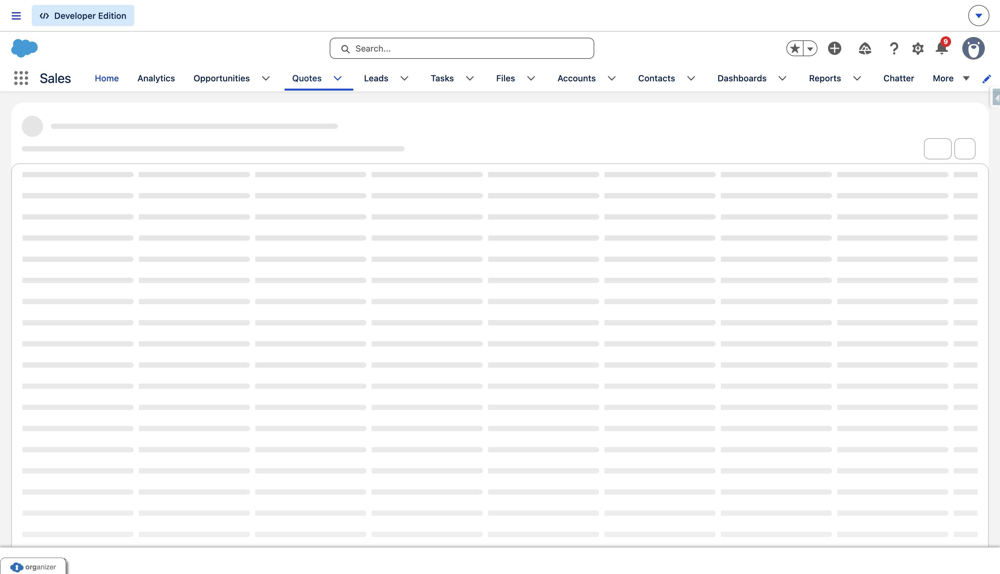
3. The user navigates to https://firstchair-b-dev-ed.develop.lightning.force.com/lightning/o/Quote/list?filterName=__Recent.
4. The user clicks on "TESTY A123123 X6 123".
   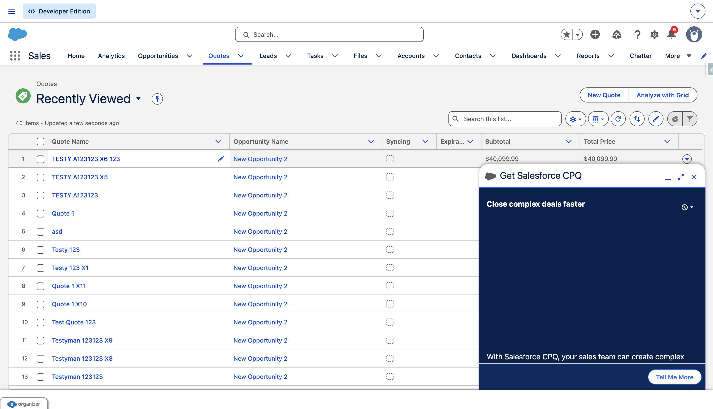
5. The user navigates to https://firstchair-b-dev-ed.develop.lightning.force.com/lightning/r/Quote/0Q0ak000003DvTNCA0/view.
6. The user clicks on "Close".
   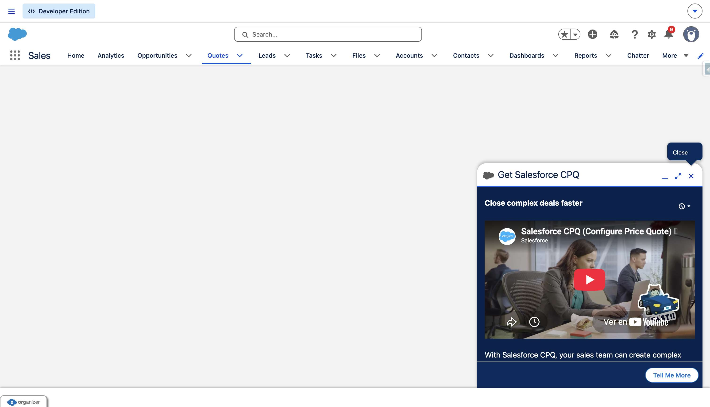
7. The user clicks on "Show more actions".
   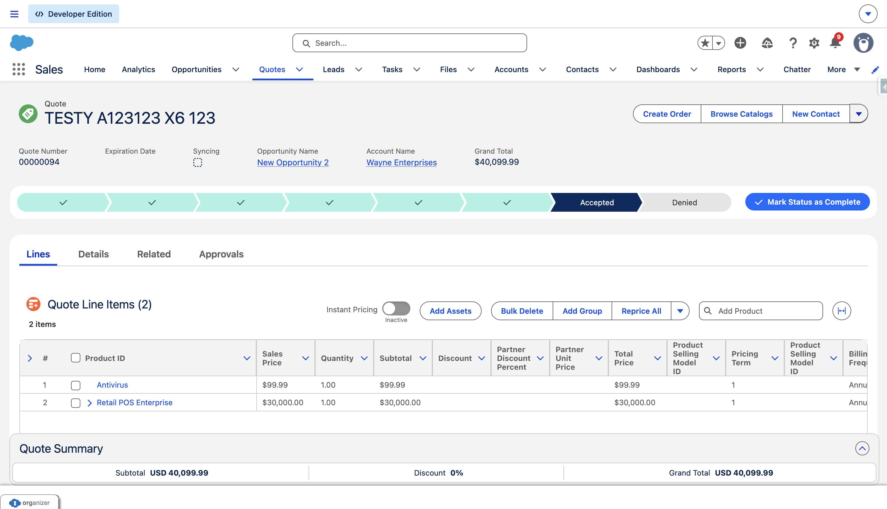
8. The user clicks on "Edit".
   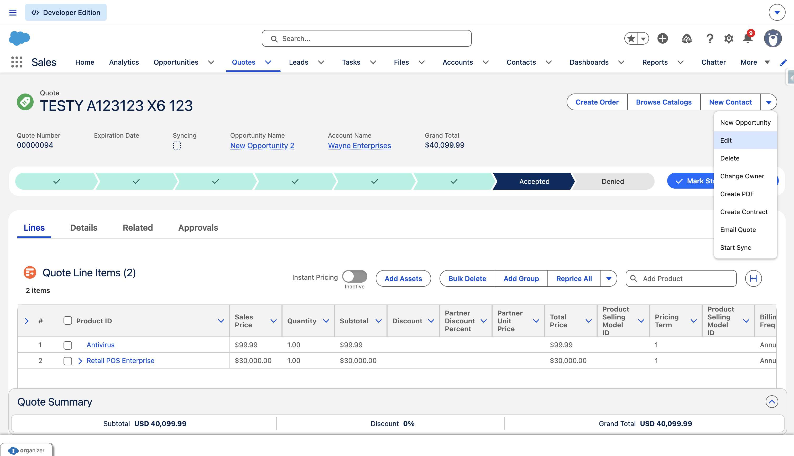
9. The user navigates to https://firstchair-b-dev-ed.develop.lightning.force.com/lightning/r/Quote/0Q0ak000003DvTNCA0/edit?count=1&backgroundContext=%2Flightning%2Fr%2FQuote%2F0Q0ak000003DvTNCA0%2Fview.
10. The user clicks on "Edit TESTY A123123 X6 123".
   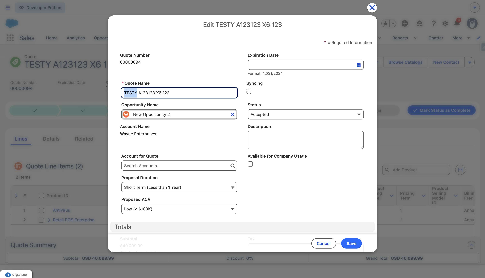
11. The user fills in "*Quote Name" with "Fede Chad A123123 X6 123".
12. The user fills in "*Quote Name" with "Fede Chad".
13. The user clicks on "Save".
   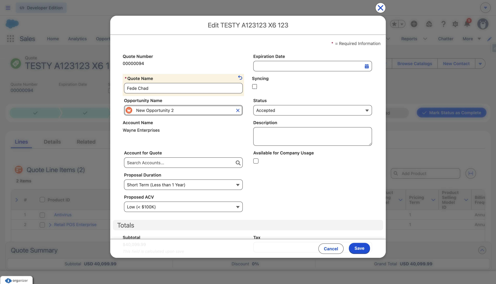
14. The user navigates to https://firstchair-b-dev-ed.develop.lightning.force.com/lightning/r/Quote/0Q0ak000003DvTNCA0/view.
15. The user clicks on "Browse Catalogs".
   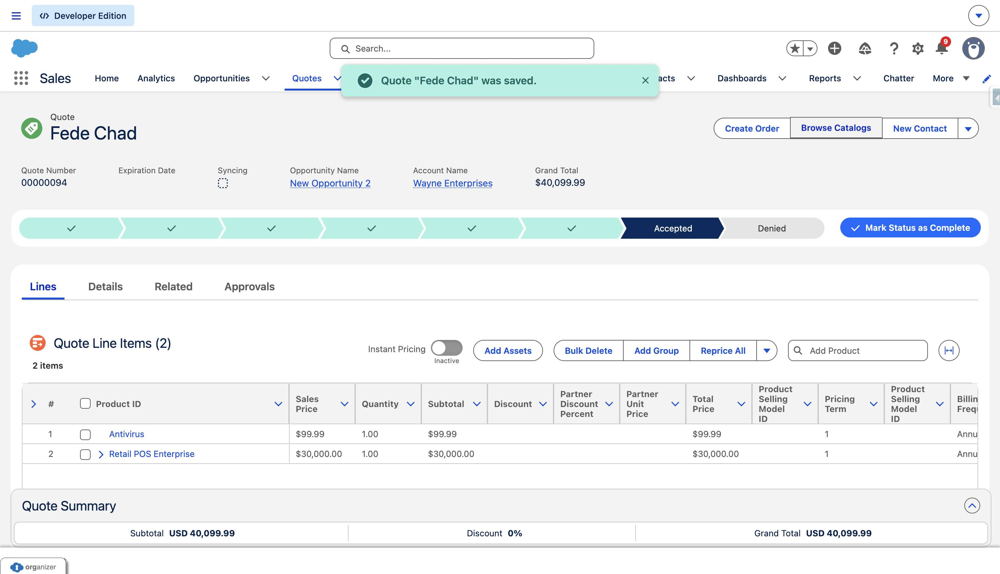
16. The user clicks on "Select Item 2".
   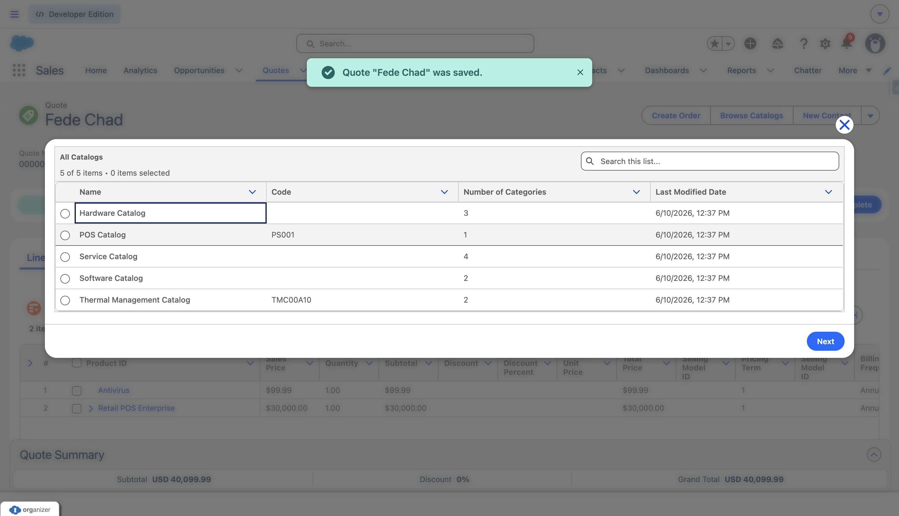
17. The user fills in "Select Item 2" with "on".
18. The user clicks on "Next".
   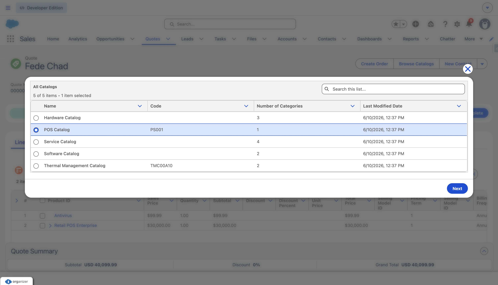
19. The user clicks on "Add".
   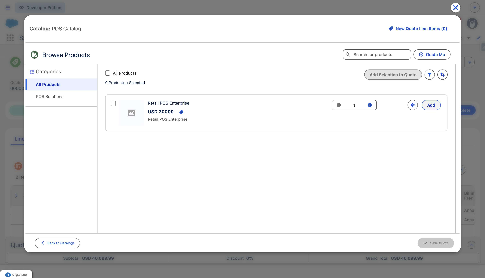
20. The user clicks on "Save Quote".
   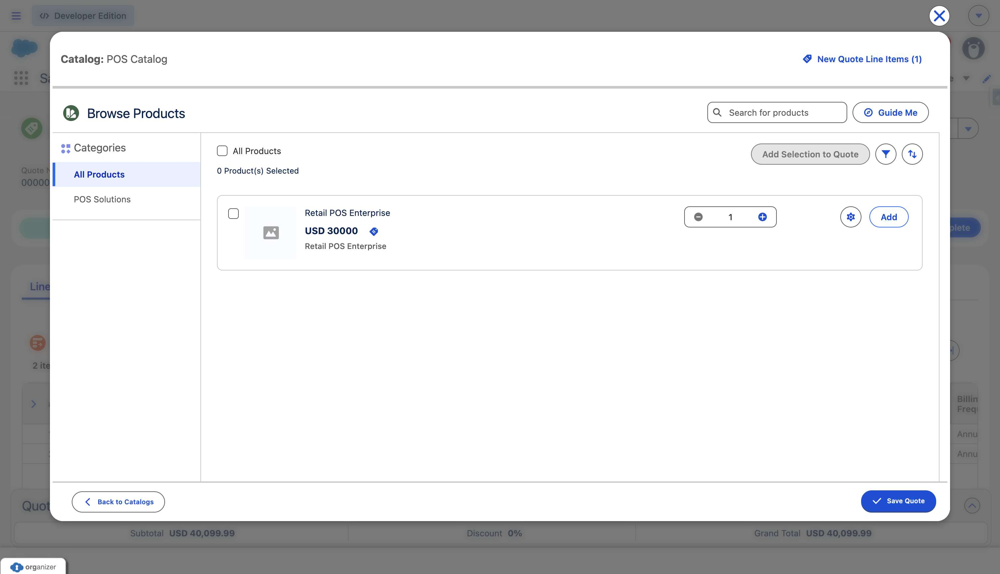
21. The user clicks on "Create Order".
   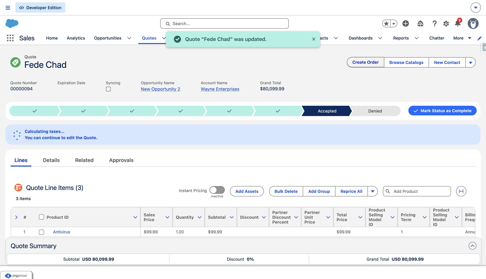
22. The user clicks on "Cancel and close
Create Order
Select an option to use for generating orders.
Cre".
   
23. The user clicks on "Create Single Order
Create a single order from the quote.".
   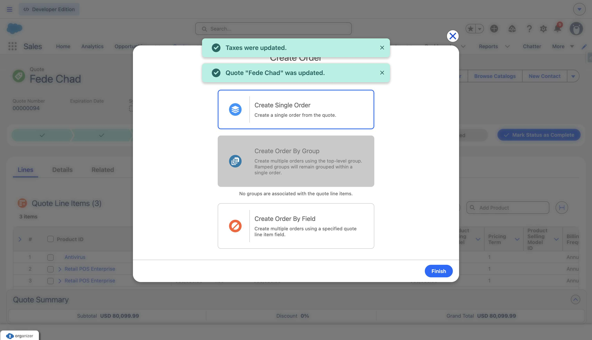
24. The user fills in "Create Single Order
Create a single order from the quote." with "CreateSingleOrder".
25. The user clicks on "Cancel and close
Create Order
Select an option to use for generating orders.
Cre".
   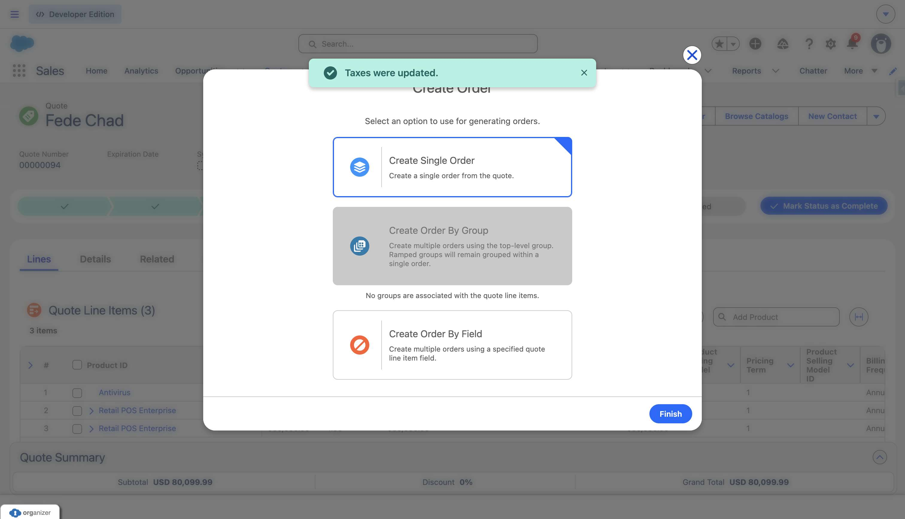
26. The user clicks on "Finish".
   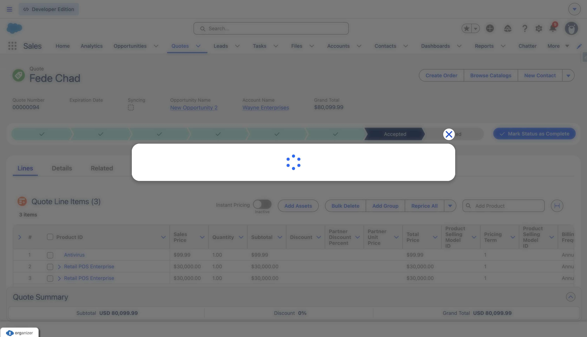
27. The user clicks on "00000178".
   
28. The user clicks on "00000178".
   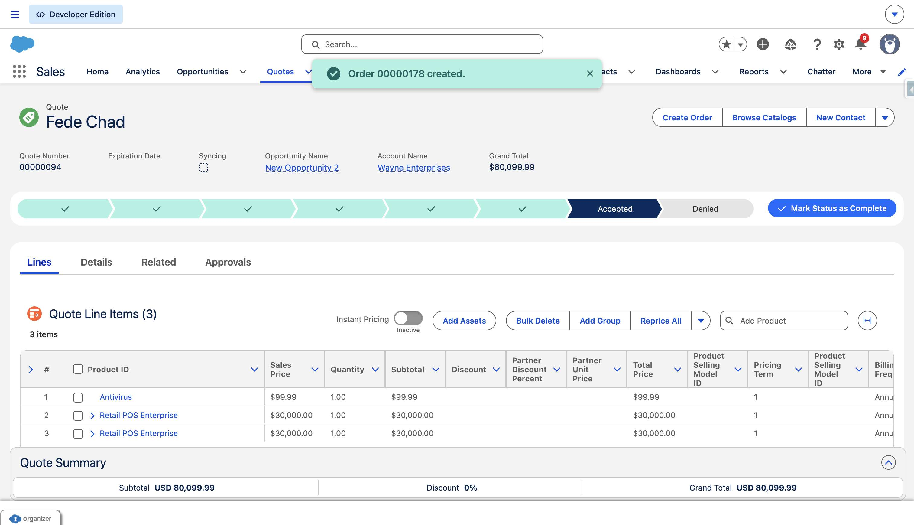
29. The user navigates to https://firstchair-b-dev-ed.develop.lightning.force.com/lightning/r/Order/801ak00003ei7ziAAA/view.
30. The user clicks on "00000178".
   
