# Test case — FACUALV-1234

_Recorded: August 28, 2026 at 10:09 AM_

## Scenario 1: Flow on Quote

1. The user navigates to https://firstchair-b-dev-ed.develop.lightning.force.com/lightning/r/Quote/0Q0ak000003DvTNCA0/view.
2. The user clicks on "Quotes".
   
3. The user navigates to https://firstchair-b-dev-ed.develop.lightning.force.com/lightning/o/Quote/list?filterName=__Recent.
4. The user clicks on "div > div > table > tbody > tr:nth-of-type(1) > th > span > button".
   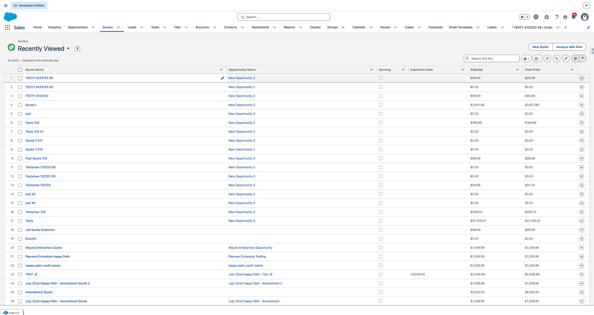
5. The user clicks on "section[aria-label="Edit\ Quote\ Name"] > div:nth-of-type(1) > form > button".
   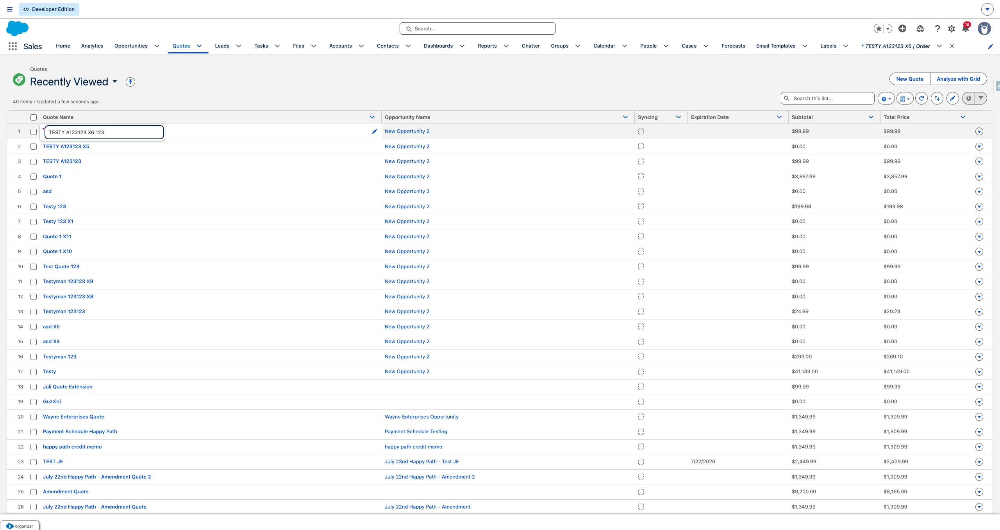
6. The user fills in "*Quote Name" with "TESTY A123123 X6 123".
7. The user clicks on "Save".
   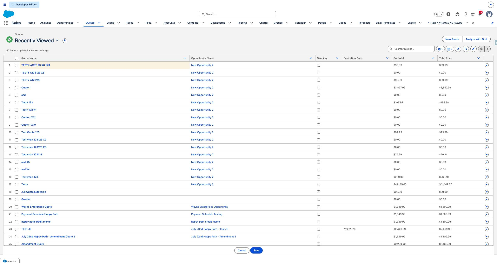
8. The user clicks on "TESTY A123123 X6 123".
   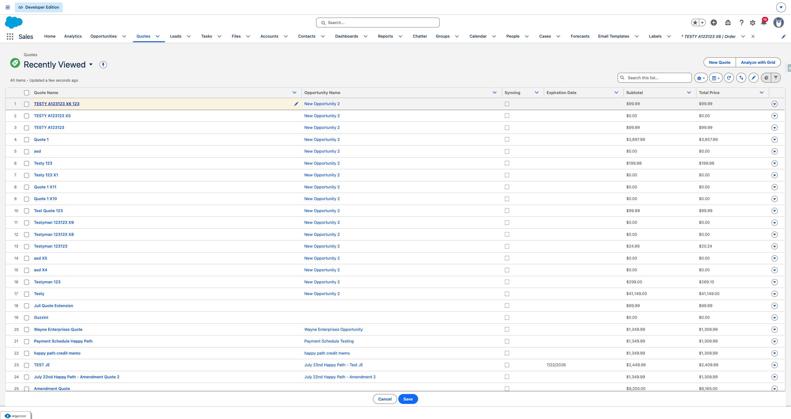
9. The user clicks on "Save".
   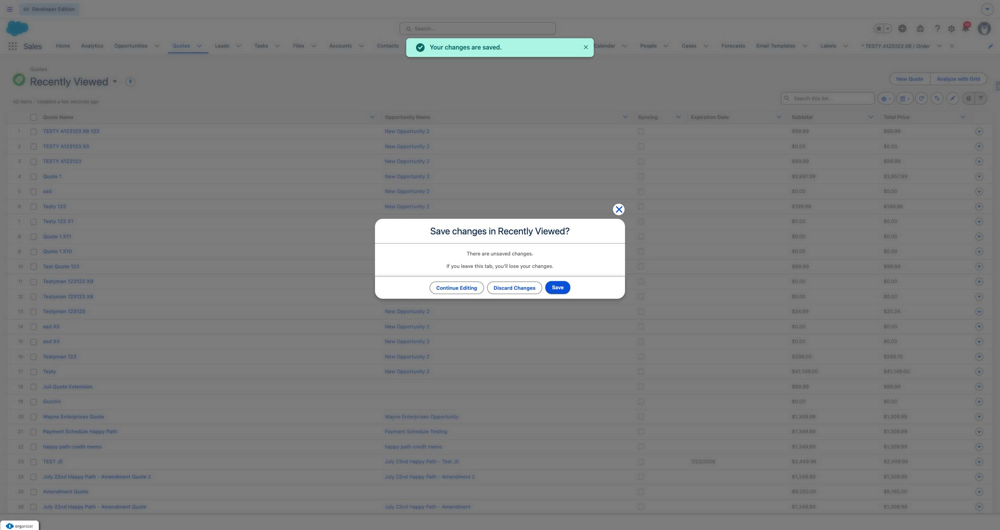
10. The user clicks on "TESTY A123123 X6 123".
   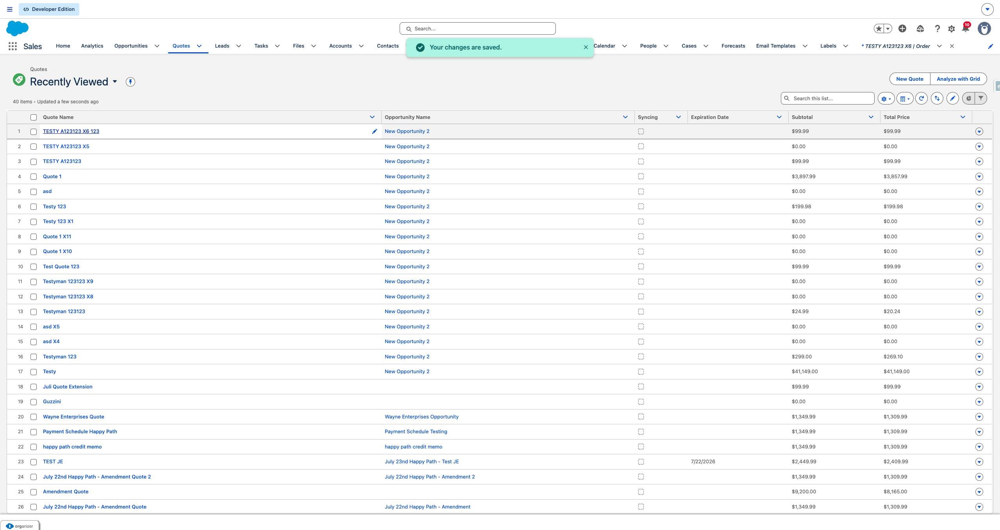
11. The user navigates to https://firstchair-b-dev-ed.develop.lightning.force.com/lightning/r/Quote/0Q0ak000003DvTNCA0/view.
12. The user clicks on "Browse Catalogs".
   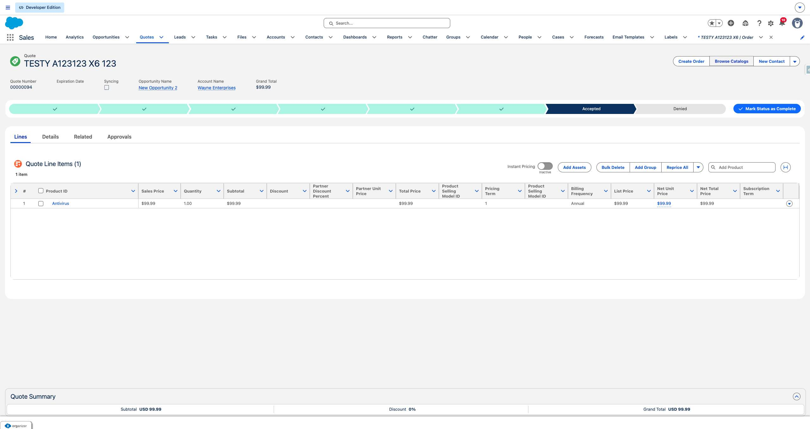
13. The user clicks on "Select Item 2".
   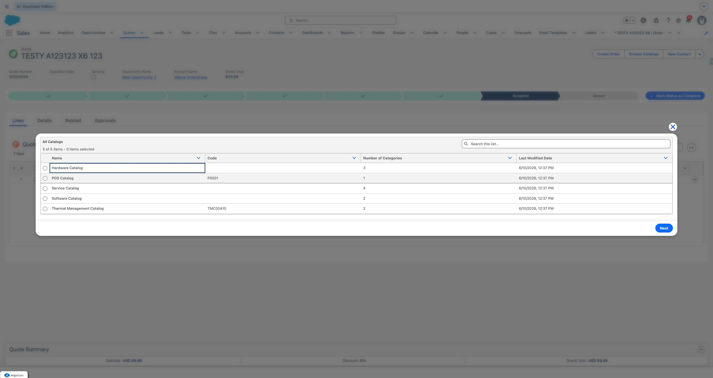
14. The user fills in "Select Item 2" with "on".
15. The user clicks on "Next".
   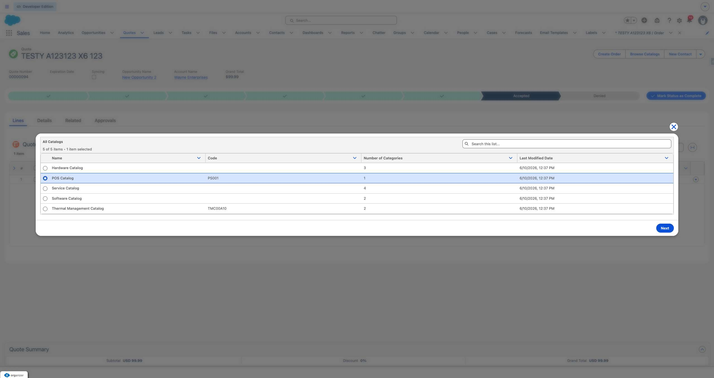
16. The user clicks on "Retail POS Enterprise".
   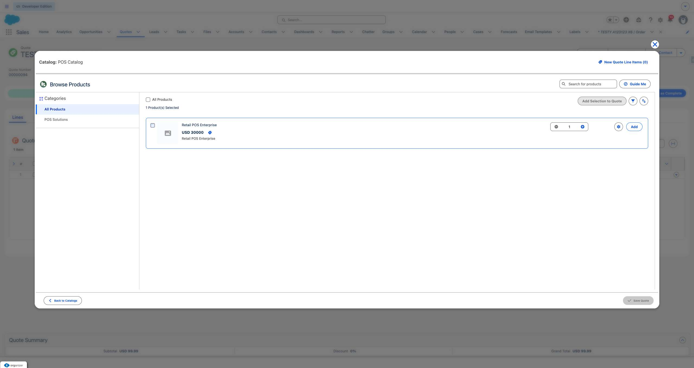
17. The user fills in "Retail POS Enterprise" with "".
18. The user clicks on "Add".
   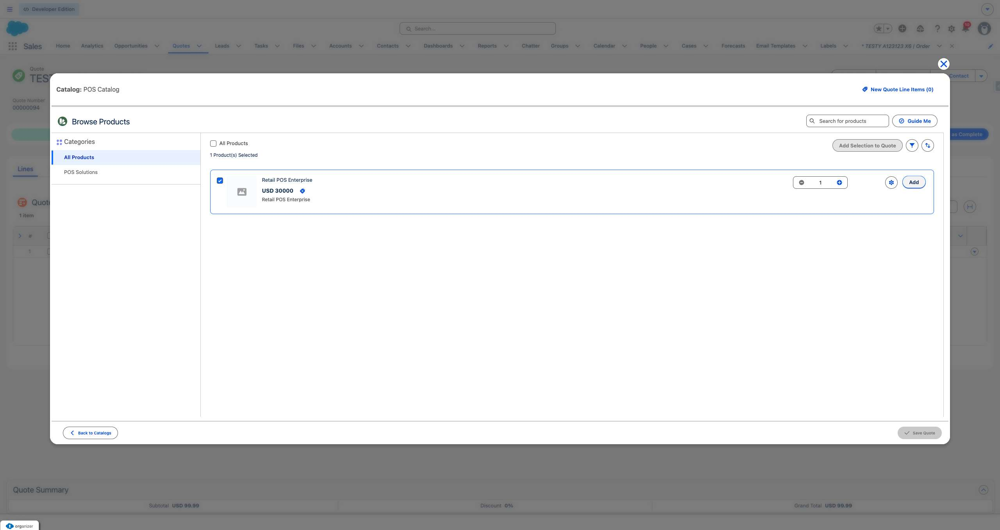
19. The user clicks on "Save Quote".
   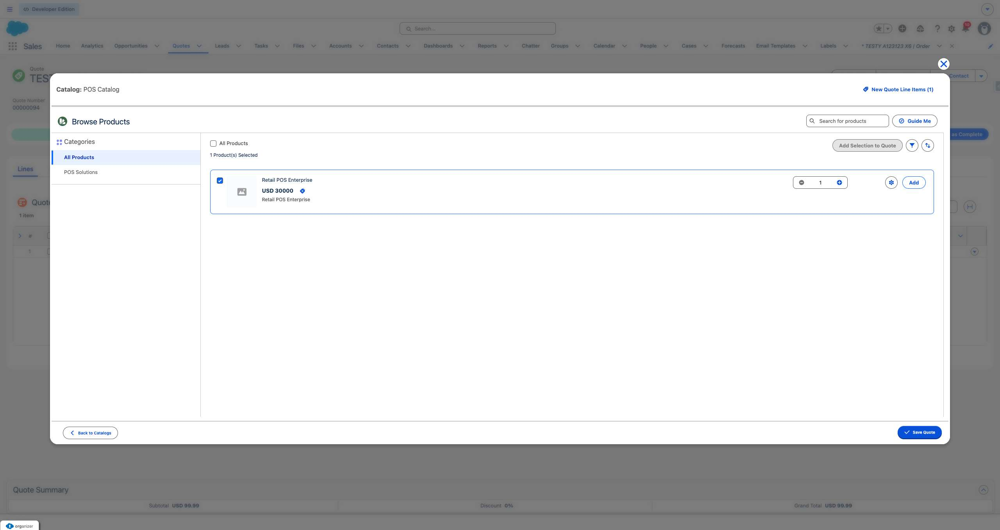
20. The user clicks on "Quote Summary
Expand Summary
Subtotal
USD 99.99
Discount
0%
Grand Total
USD 99.9".
   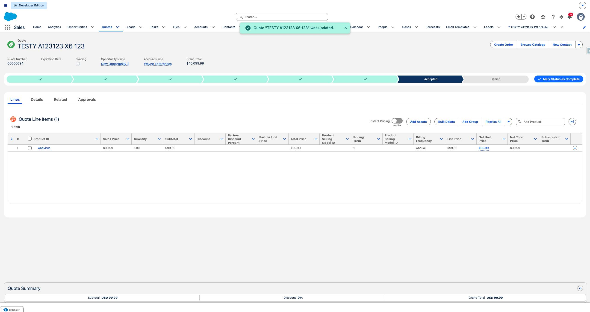
21. The user clicks on "Create Order".
   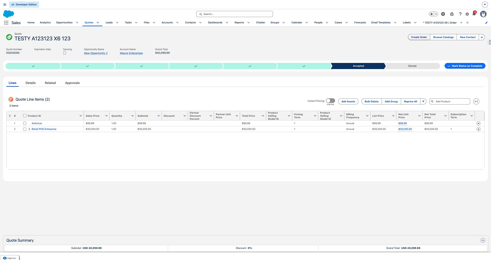
22. The user clicks on "Create Single Order
Create a single order from the quote.".
   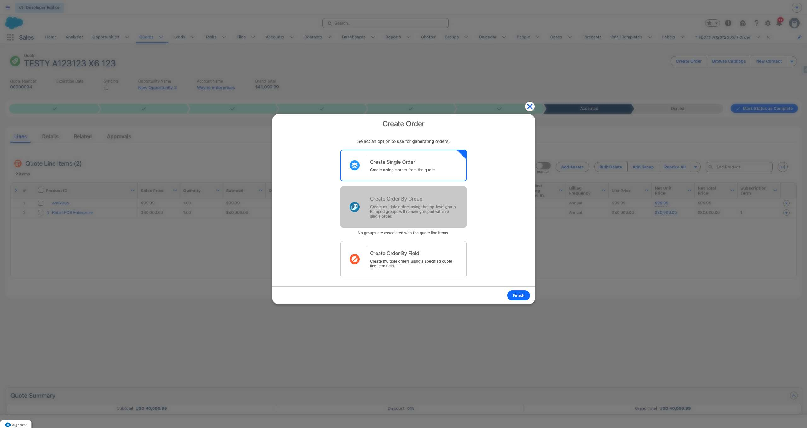
23. The user clicks on "Finish".
   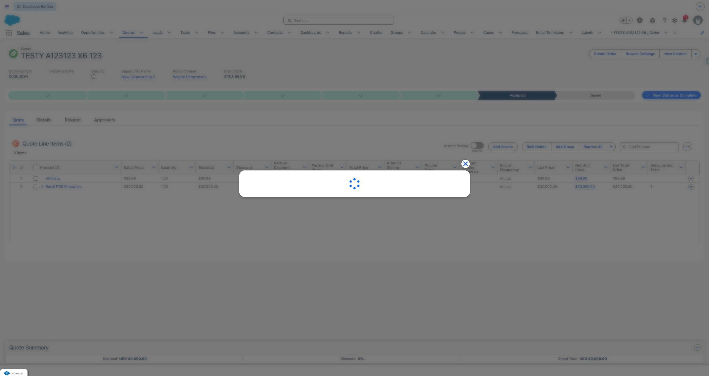
24. The user clicks on "00000176".
   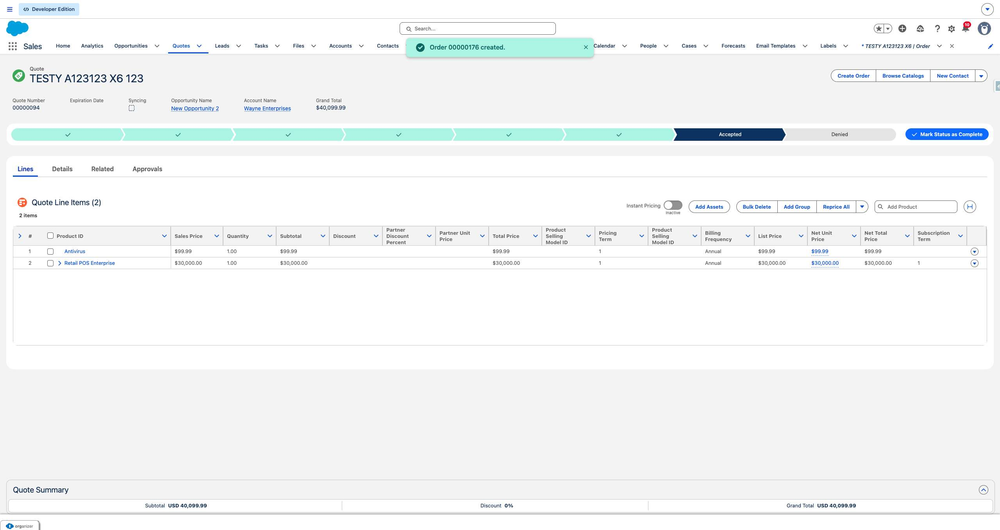
25. The user navigates to https://firstchair-b-dev-ed.develop.lightning.force.com/lightning/r/Order/801ak00003Sn4c4AAB/view.
26. The user clicks on "00000176".
   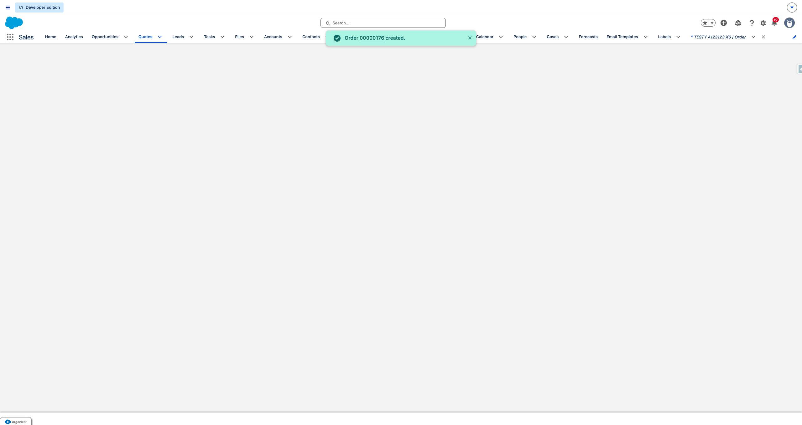
