# Test case — JB-1234

_Recorded: September 15, 2026 at 10:57 AM_

## Scenario 1: /lightning/page/home

1. The user navigates to https://firstchair-b-dev-ed.develop.lightning.force.com/lightning/page/home.
2. The user clicks on "Quotes".
   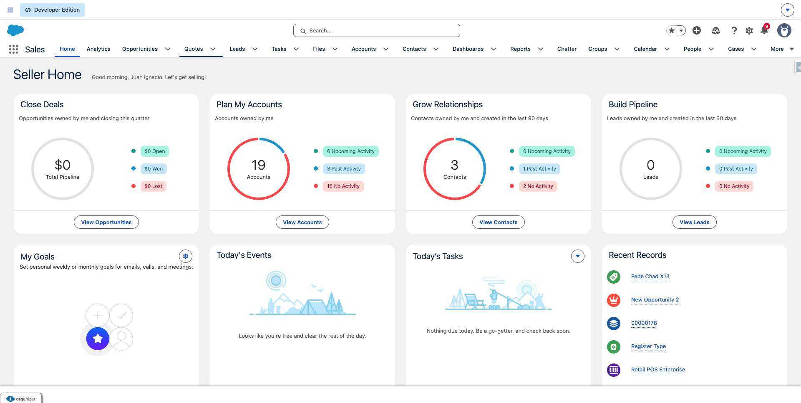
3. The user navigates to https://firstchair-b-dev-ed.develop.lightning.force.com/lightning/o/Quote/list?filterName=__Recent.
4. The user clicks on "Quote 1".
   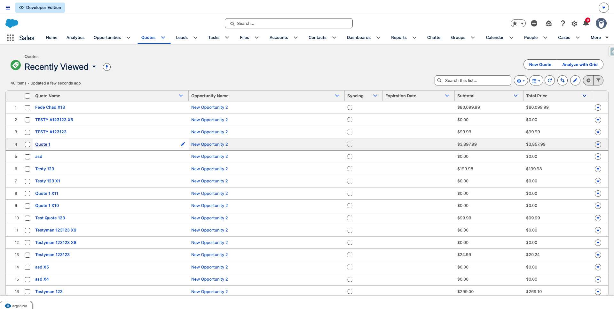
5. The user navigates to https://firstchair-b-dev-ed.develop.lightning.force.com/lightning/r/Quote/0Q0ak000003DY5NCAW/view.
6. The user clicks on "Show more actions".
   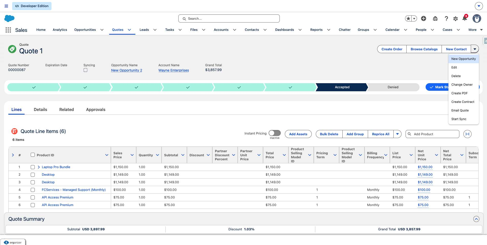
7. The user clicks on "Edit".
   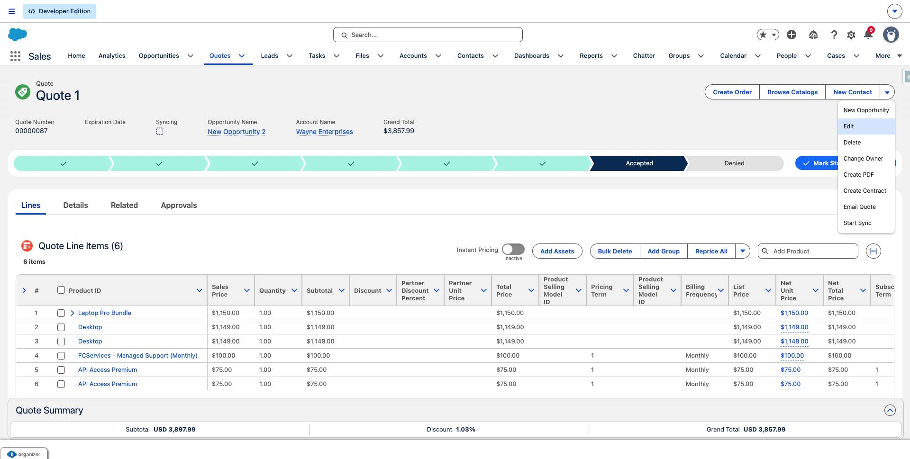
8. The user navigates to https://firstchair-b-dev-ed.develop.lightning.force.com/lightning/r/Quote/0Q0ak000003DY5NCAW/edit?count=1&backgroundContext=%2Flightning%2Fr%2FQuote%2F0Q0ak000003DY5NCAW%2Fview.
9. The user clicks on "*Quote Name".
   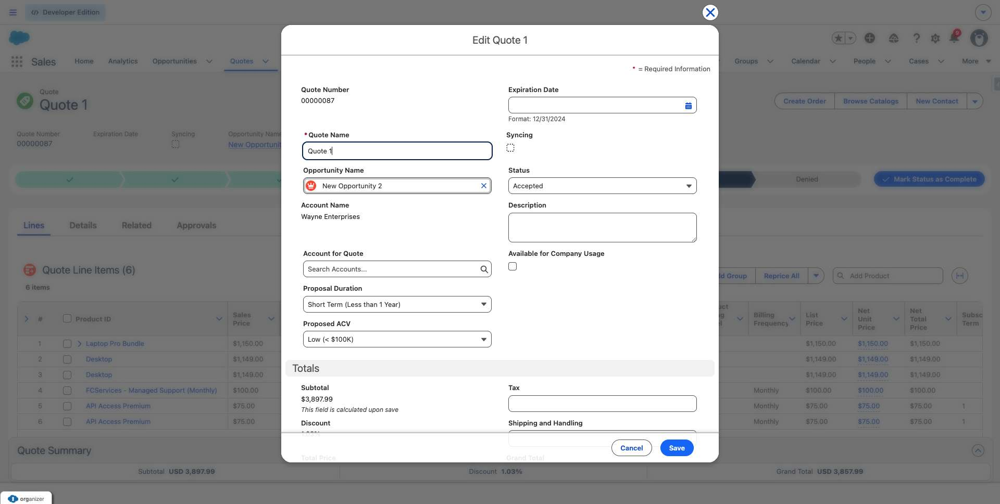
10. The user fills in "*Quote Name" with "".
11. The user fills in "*Quote Name" with "pitin".
12. The user clicks on "Save".
   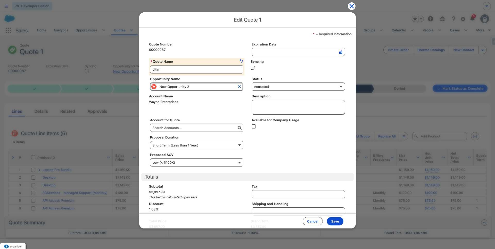
13. The user navigates to https://firstchair-b-dev-ed.develop.lightning.force.com/lightning/r/Quote/0Q0ak000003DY5NCAW/view.
14. The user clicks on "Create Order".
   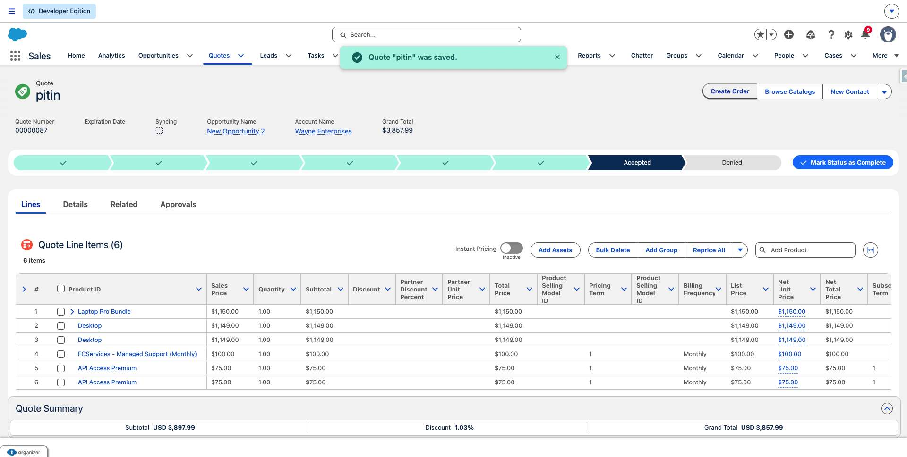
15. The user clicks on "Cancel and close
Create Order
Select an option to use for generating orders.
Cre".
   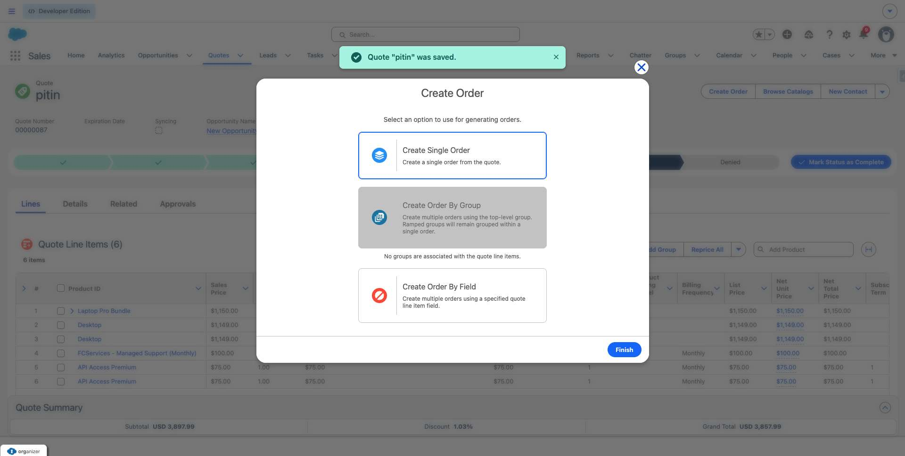
16. The user clicks on "Create Single Order
Create a single order from the quote.".
   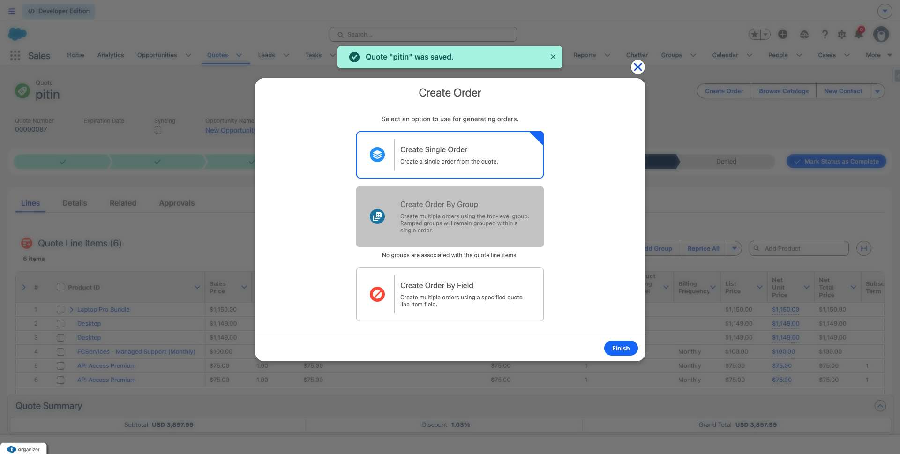
17. The user fills in "Create Single Order
Create a single order from the quote." with "CreateSingleOrder".
18. The user clicks on "Finish".
   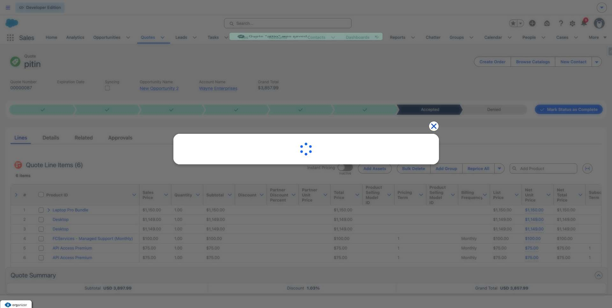
19. The user clicks on "Close".
   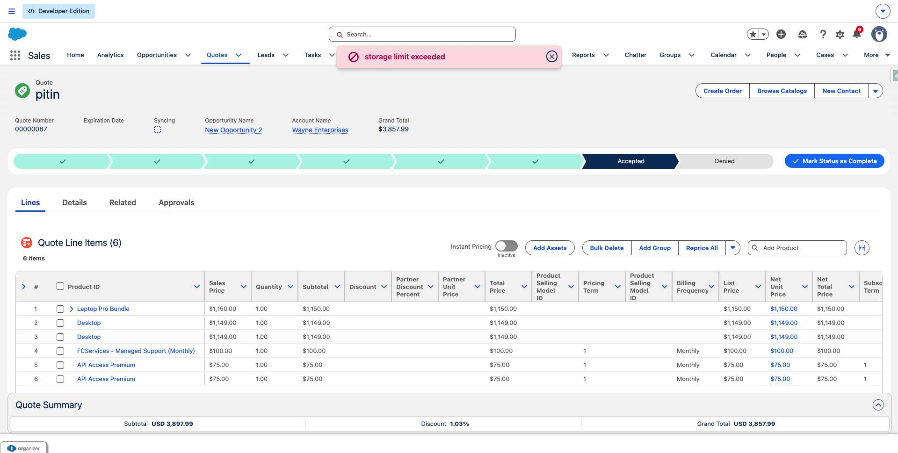
20. The user navigates to https://firstchair-b-dev-ed.develop.lightning.force.com/lightning/page/home.
21. The user clicks on "Tasks".
   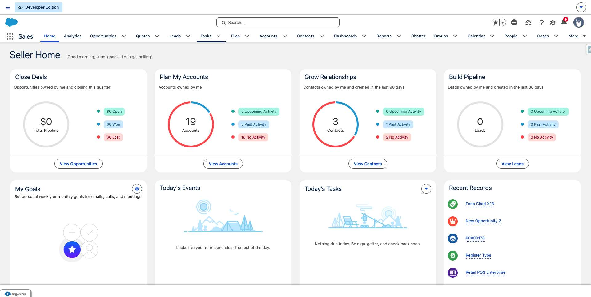
