# Test case — JIRA-1234

_Recorded: August 27, 2026 at 6:56 PM_

## Scenario 1: Flow on Opportunity

1. The user navigates to https://firstchair-b-dev-ed.develop.lightning.force.com/lightning/r/Opportunity/006ak00000Y2MLpAAN/view.
2. The user clicks on "Opportunities".
   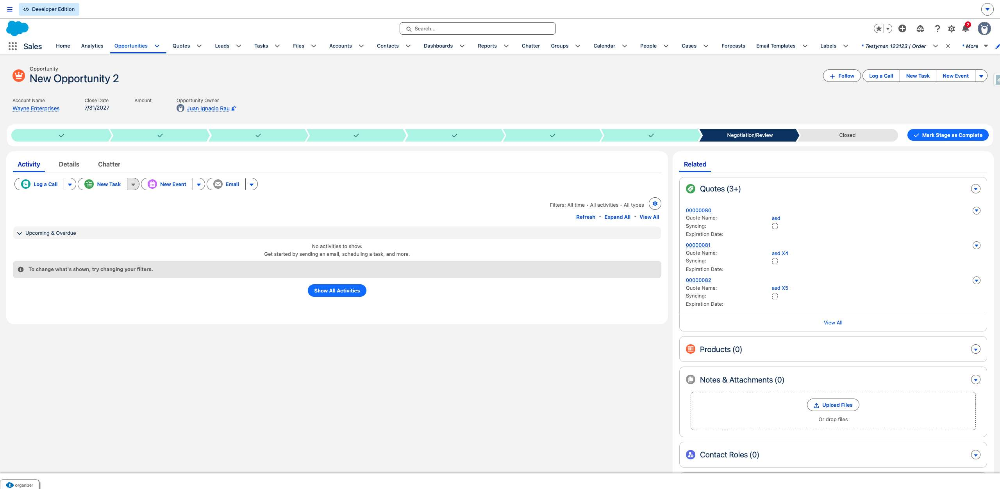
3. The user navigates to https://firstchair-b-dev-ed.develop.lightning.force.com/lightning/o/Opportunity/list?filterName=__Recent.
4. The user clicks on "New Opportunity 2".
   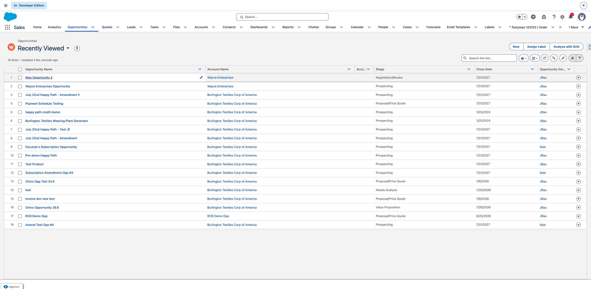
5. The user navigates to https://firstchair-b-dev-ed.develop.lightning.force.com/lightning/r/Opportunity/006ak00000Y2MLpAAN/view.
6. The user clicks on "Show actions for Quotes".
   
7. The user clicks on "New Quote".
   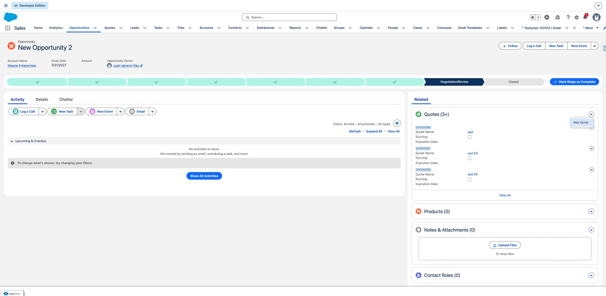
8. The user navigates to https://firstchair-b-dev-ed.develop.lightning.force.com/lightning/o/Quote/new?count=1&nooverride=1&useRecordTypeCheck=1&navigationLocation=RELATED_LIST&uid=178786588137640209&backgroundContext=%2Flightning%2Fr%2FOpportunity%2F006ak00000Y2MLpAAN%2Fview.
9. The user clicks on "*Quote Name".
   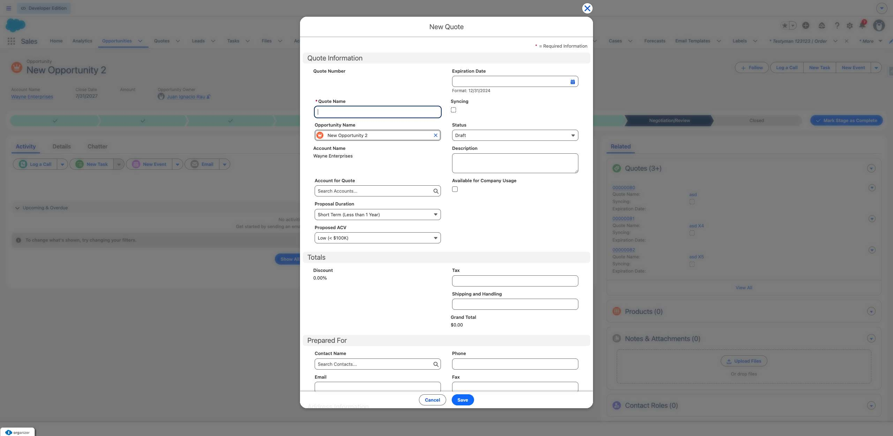
10. The user fills in "*Quote Name" with "Testy 123".
11. The user clicks on "Save".
   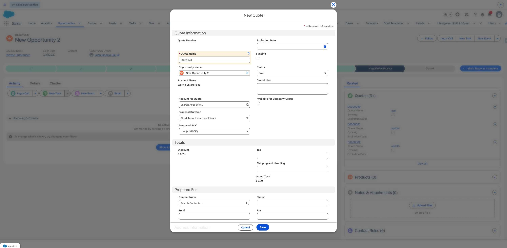
12. The user navigates to https://firstchair-b-dev-ed.develop.lightning.force.com/lightning/r/Opportunity/006ak00000Y2MLpAAN/view.
13. The user clicks on "Skip to Navigation
Skip to Main Content
Menu
Developer Edition
Show menu
Search.".
   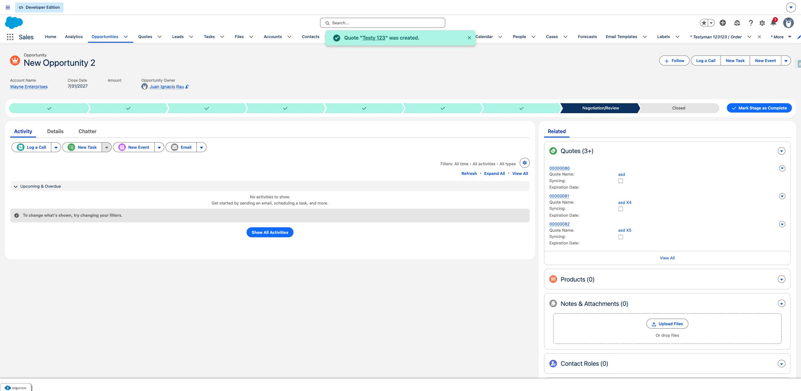
14. The user clicks on "Testy 123".
   
15. The user navigates to https://firstchair-b-dev-ed.develop.lightning.force.com/lightning/r/Quote/0Q0ak000003DYuzCAG/view.
16. The user clicks on "Accepted".
   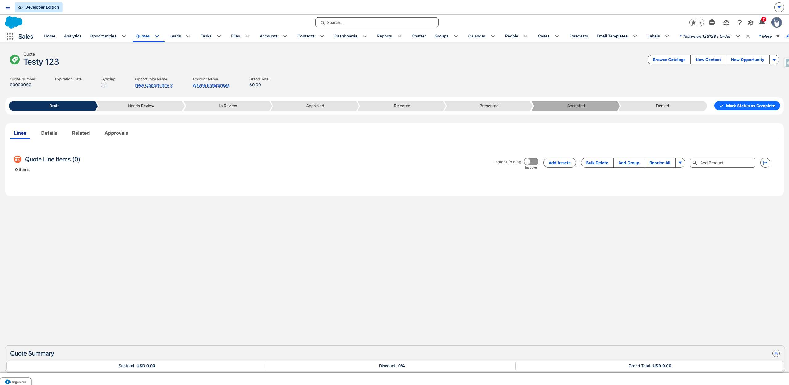
17. The user clicks on "Mark as Current Status".
   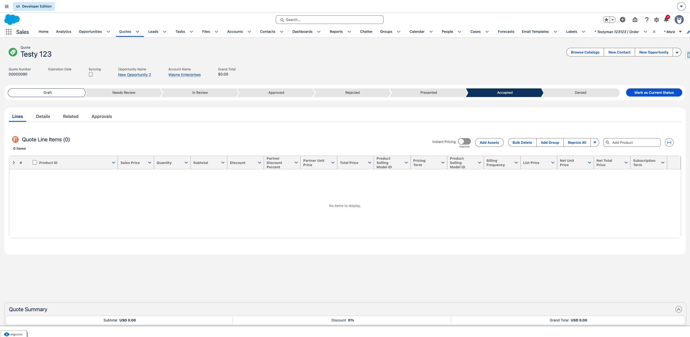
18. The user clicks on "Browse Catalogs".
   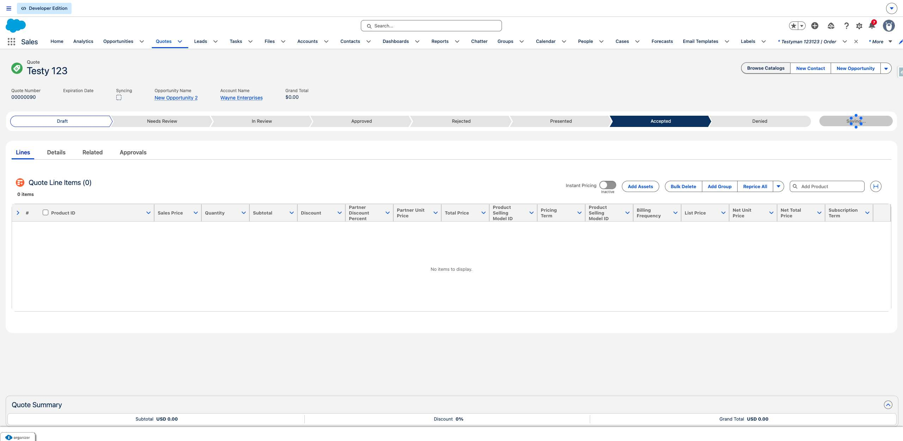
19. The user clicks on "Save".
   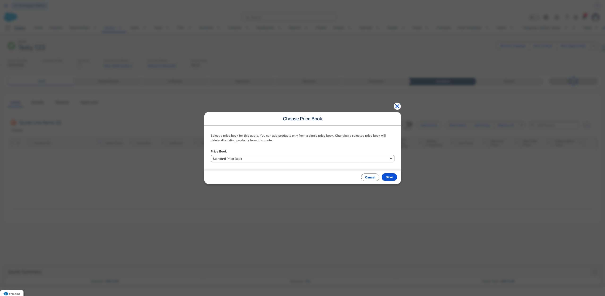
20. The user clicks on "Select Item 4".
   
21. The user clicks on "Select Item 4".
   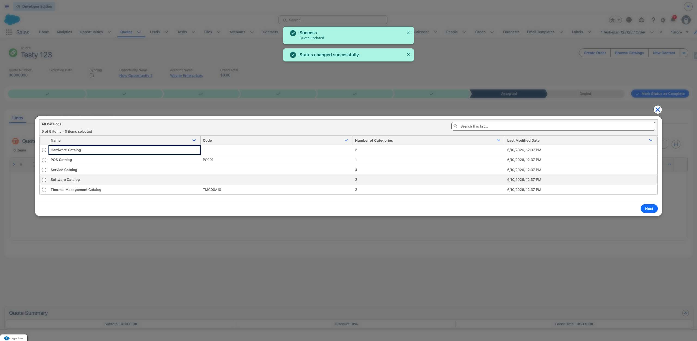
22. The user fills in "Select Item 4" with "on".
23. The user clicks on "Next".
   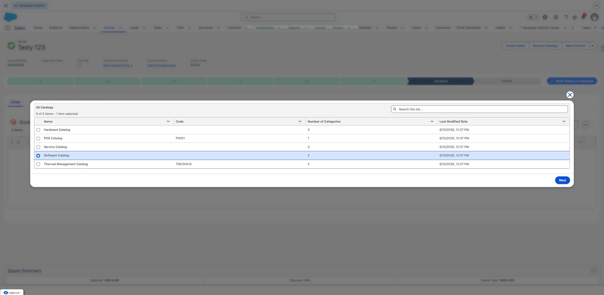
24. The user clicks on "Protection Software".
   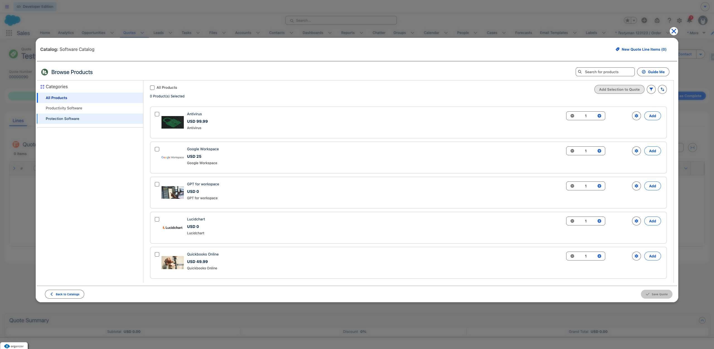
25. The user clicks on "Add".
   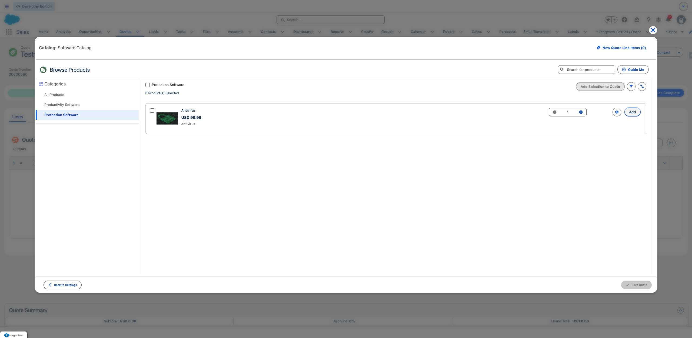
26. The user clicks on "Save Quote".
   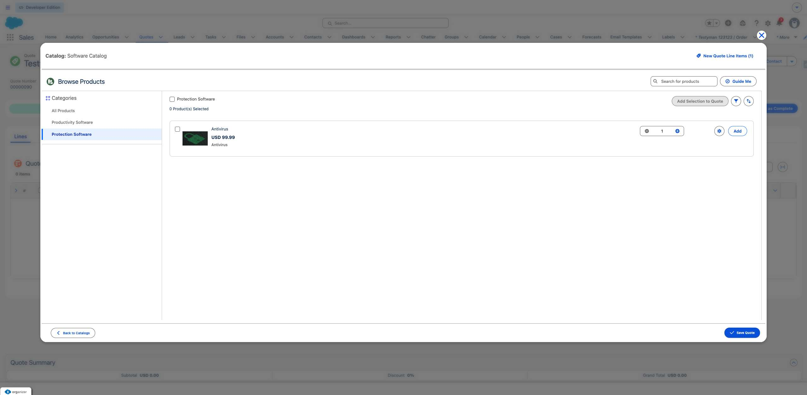
