# Test case — JIRA-1234

_Recorded: September 8, 2026 at 4:01 PM_

## Scenario 1: Flow on Quote

1. The user navigates to https://firstchair-b-dev-ed.develop.lightning.force.com/lightning/o/Quote/list?filterName=__Recent.
2. The user clicks on "Quotes".
   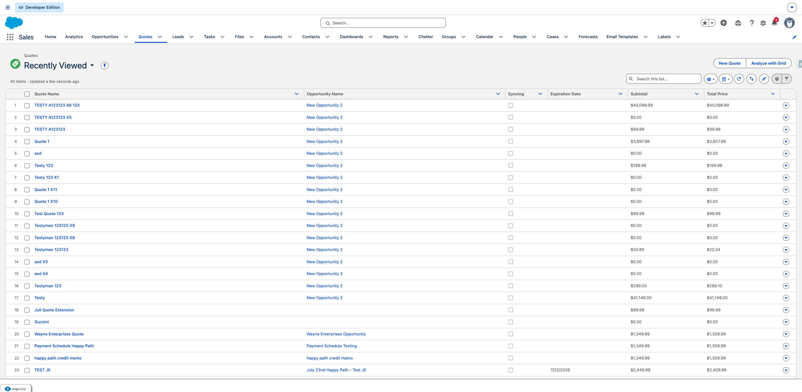
3. The user clicks on "TESTY A123123 X6 123".
   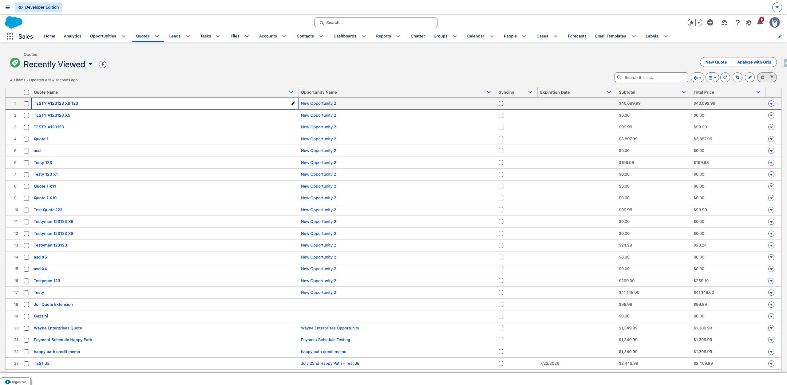
4. The user navigates to https://firstchair-b-dev-ed.develop.lightning.force.com/lightning/r/Quote/0Q0ak000003DvTNCA0/view.
5. The user clicks on "Rejected".
   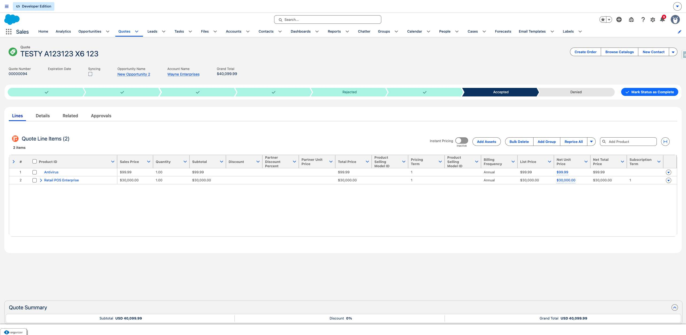
6. The user clicks on "Presented".
   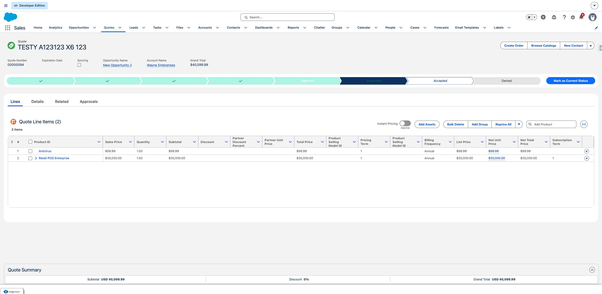
7. The user clicks on "Mark as Current Status".
   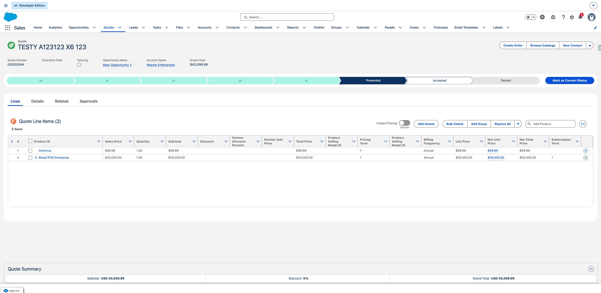
8. The user clicks on "Accepted".
   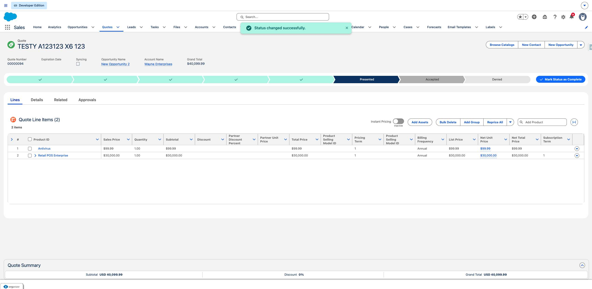
9. The user clicks on "Mark as Current Status".
   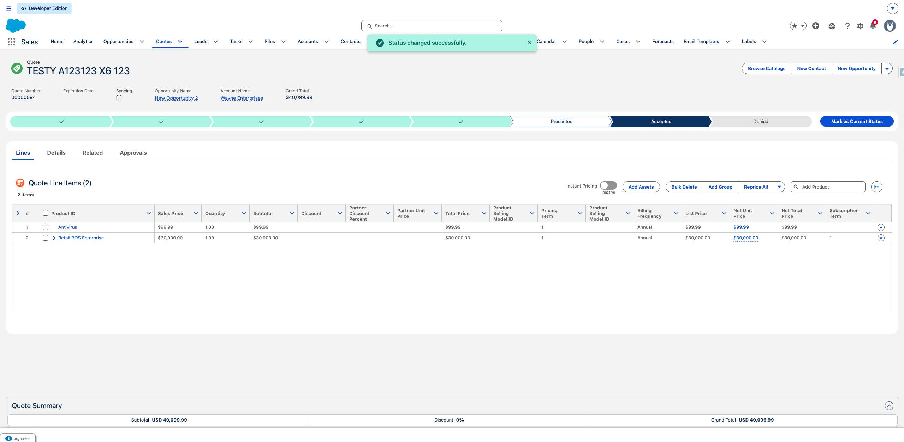
10. The user clicks on "Browse Catalogs".
   
11. The user clicks on "Select Item 3".
   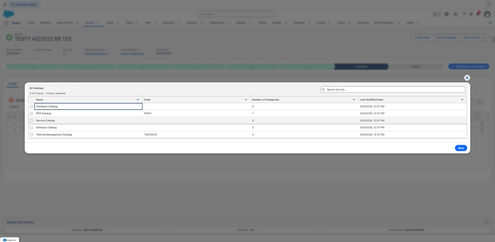
12. The user fills in "Select Item 3" with "on".
13. The user clicks on "Cancel and close
Loading".
   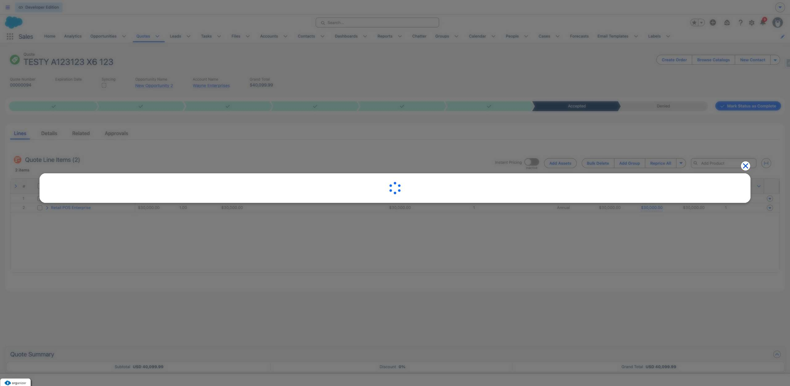
14. The user clicks on "Basic Training".
   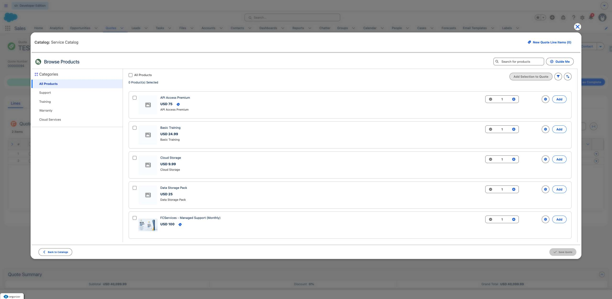
15. The user fills in "Basic Training" with "".
16. The user clicks on "Add".
   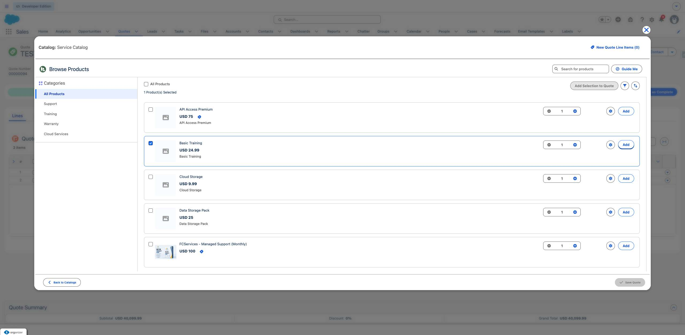
17. The user clicks on "Cancel and close".
   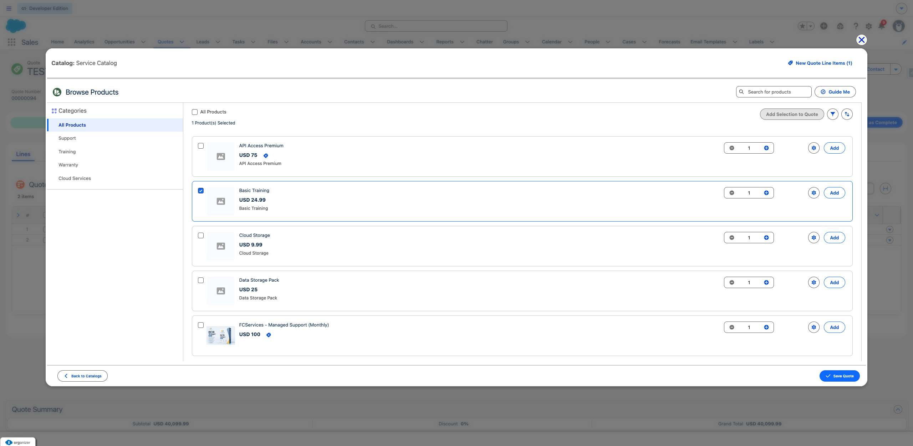
18. The user clicks on "Quote Summary
Expand Summary
Subtotal
USD 40,099.99
Discount
0%
Grand Total
USD ".
   
19. The user clicks on "Show more actions".
   
20. The user clicks on "Quote
TESTY A123123 X6 123
Create Order
Browse Catalogs
New Contact
Show more ac".
   
21. The user clicks on "Create Single Order
Create a single order from the quote.".
   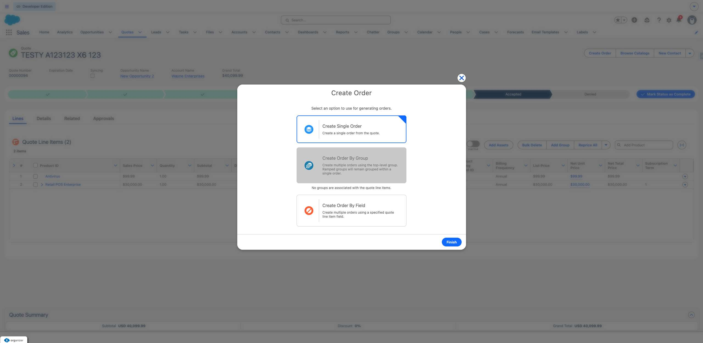
22. The user clicks on "Finish".
   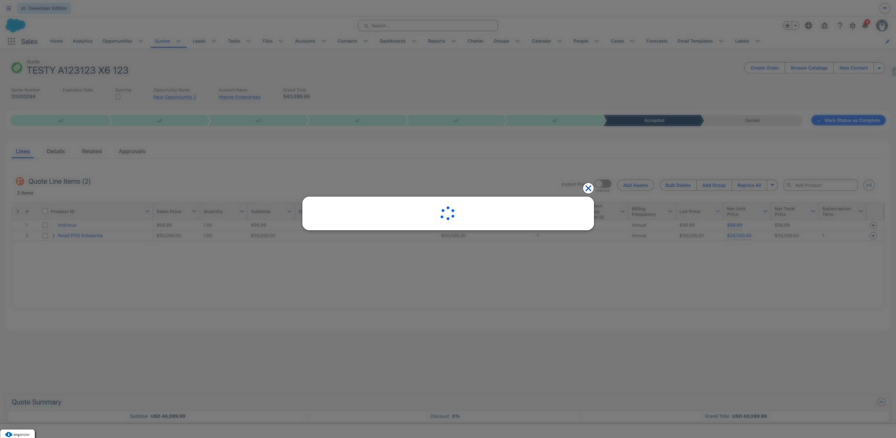
23. The user clicks on "00000177".
   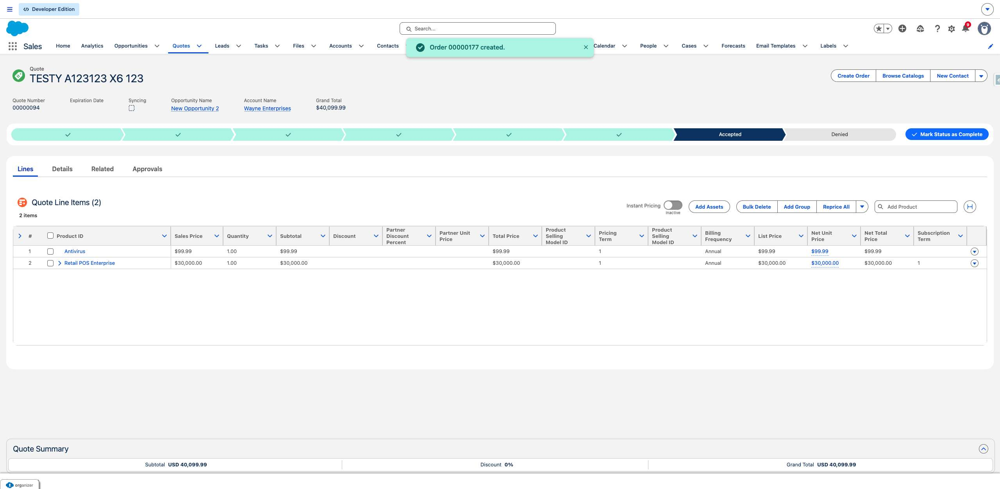
24. The user clicks on "00000177".
   
