# Test case — JIRA-12345

_Recorded: August 27, 2026 at 10:23 PM_

## Scenario 1: /lightning/page/home

1. The user navigates to https://firstchair-b-dev-ed.develop.lightning.force.com/lightning/page/home.
2. The user clicks on "Opportunities".
   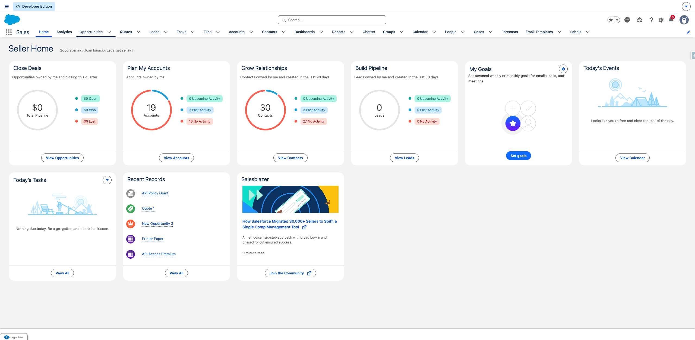
3. The user navigates to https://firstchair-b-dev-ed.develop.lightning.force.com/lightning/o/Opportunity/list?filterName=__Recent.
4. The user clicks on "New Opportunity 2".
   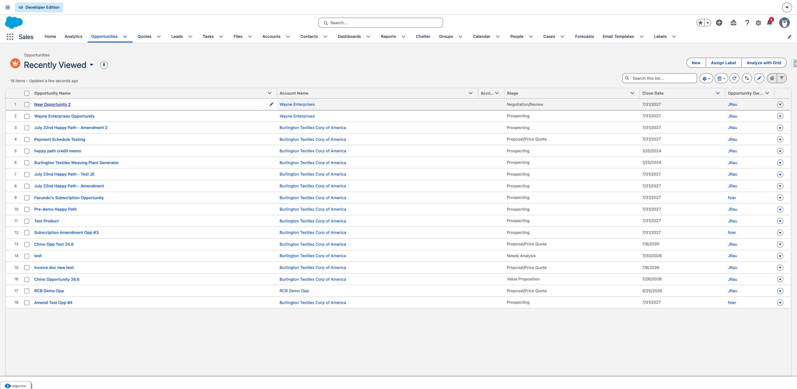
5. The user navigates to https://firstchair-b-dev-ed.develop.lightning.force.com/lightning/r/Opportunity/006ak00000Y2MLpAAN/view.
6. The user clicks on "Show actions for Quotes".
   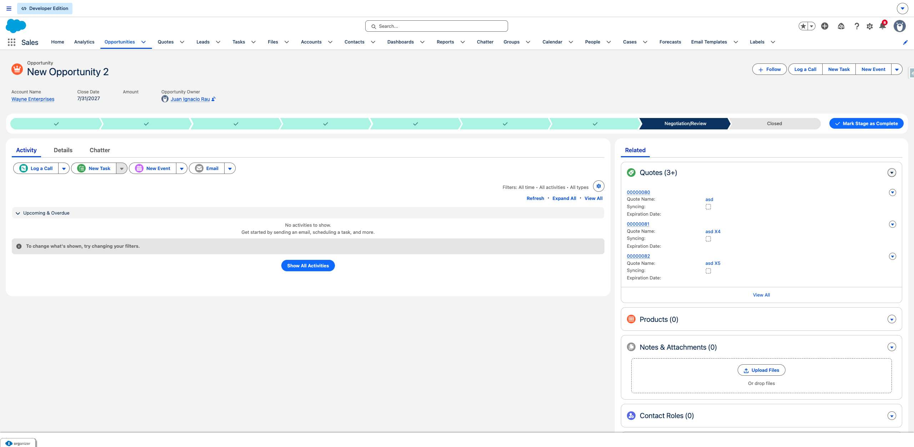
7. The user clicks on "New Quote".
   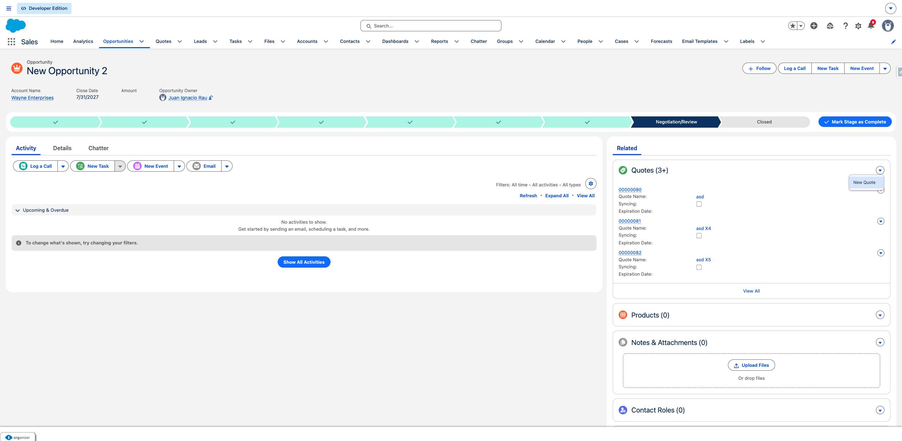
8. The user navigates to https://firstchair-b-dev-ed.develop.lightning.force.com/lightning/o/Quote/new?count=1&nooverride=1&useRecordTypeCheck=1&navigationLocation=RELATED_LIST&uid=178788009900069600&backgroundContext=%2Flightning%2Fr%2FOpportunity%2F006ak00000Y2MLpAAN%2Fview.
9. The user clicks on "*Quote Name".
   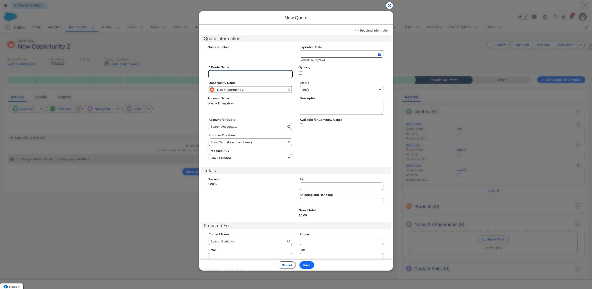
10. The user fills in "*Quote Name" with "TESTY A123123".
11. The user clicks on "Save".
   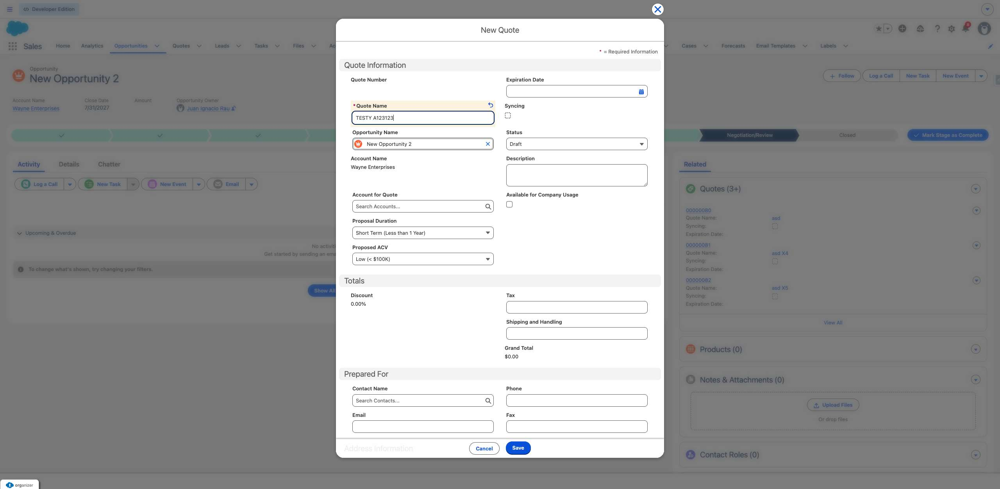
12. The user navigates to https://firstchair-b-dev-ed.develop.lightning.force.com/lightning/r/Opportunity/006ak00000Y2MLpAAN/view.
13. The user clicks on "TESTY A123123".
   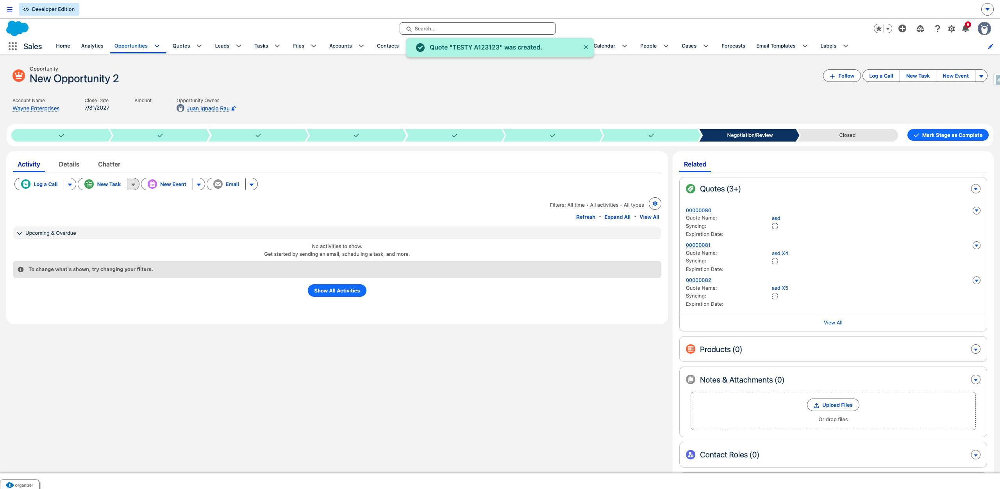
14. The user navigates to https://firstchair-b-dev-ed.develop.lightning.force.com/lightning/r/Quote/0Q0ak000003DfMzCAK/view.
15. The user clicks on "Browse Catalogs".
   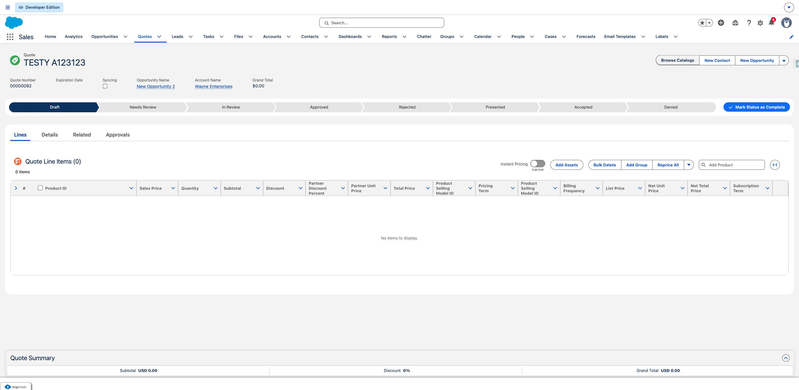
16. The user clicks on "Save".
   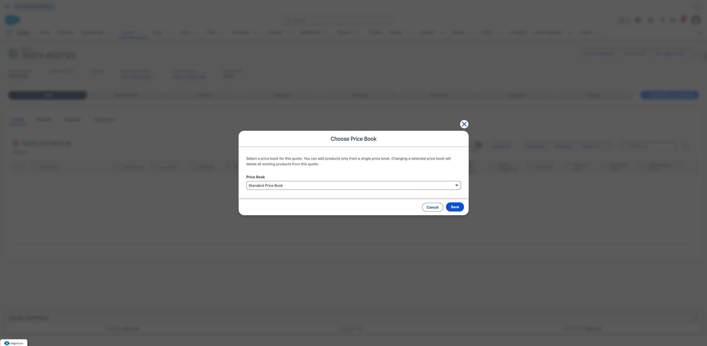
17. The user clicks on "Select Item 4".
   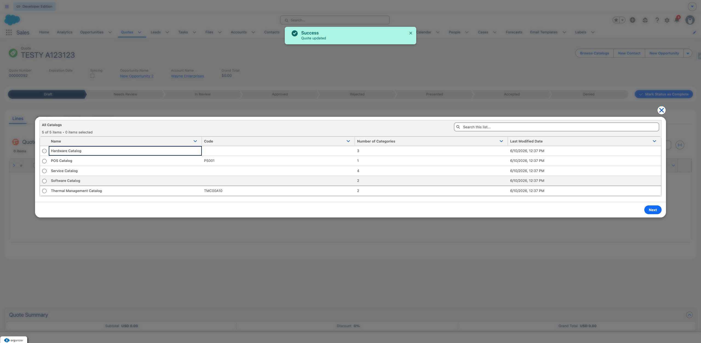
18. The user fills in "Select Item 4" with "on".
19. The user clicks on "Next".
   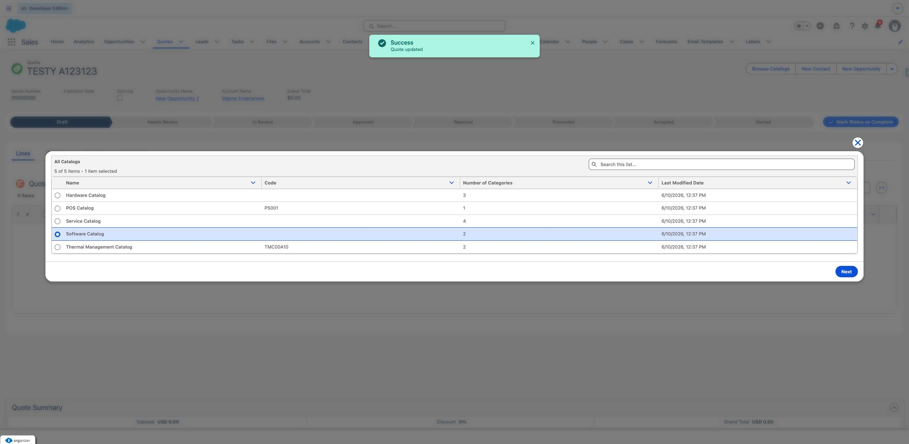
20. The user clicks on "Add".
   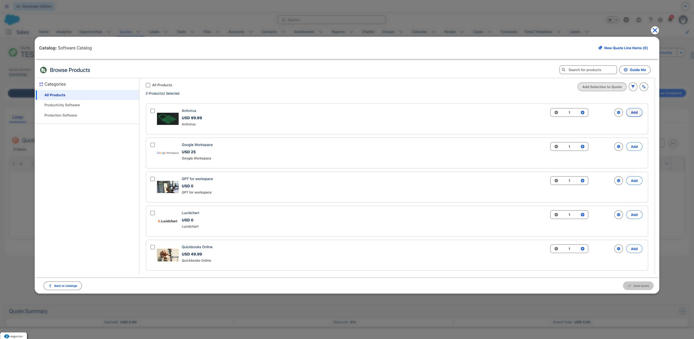
21. The user clicks on "Save Quote".
   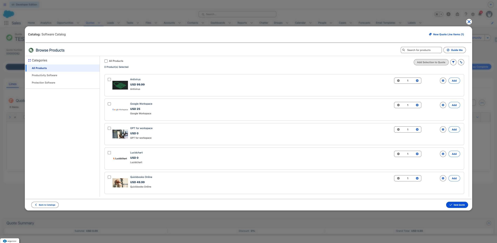
