# Test case — usage-1234

_Recorded: August 28, 2026 at 9:43 AM_

## Scenario 1: Flow on Quote

1. The user navigates to https://firstchair-b-dev-ed.develop.lightning.force.com/lightning/r/Quote/0Q0ak000003DvTNCA0/view.
2. The user clicks on "Needs Review".
   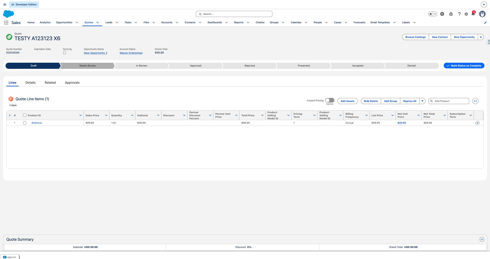
3. The user clicks on "Needs Review".
   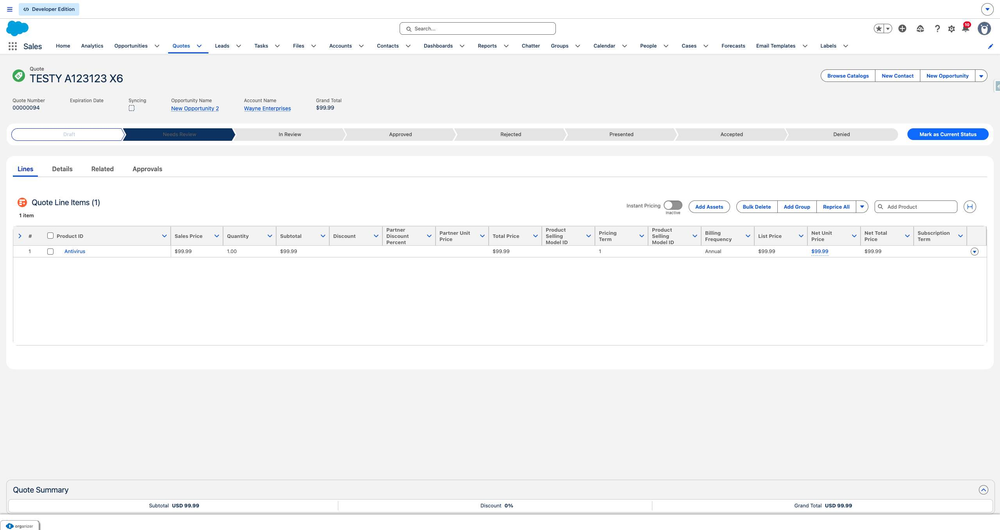
4. The user clicks on "Mark as Current Status".
   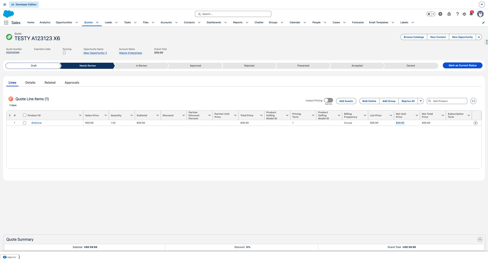
5. The user clicks on "Accepted".
   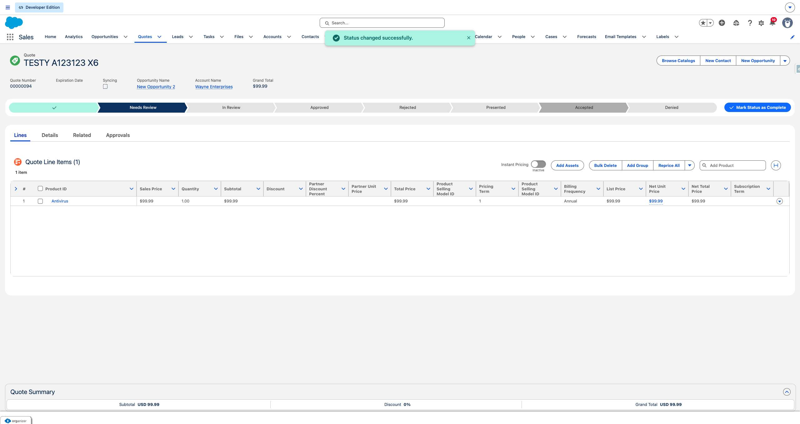
6. The user clicks on "Mark as Current Status".
   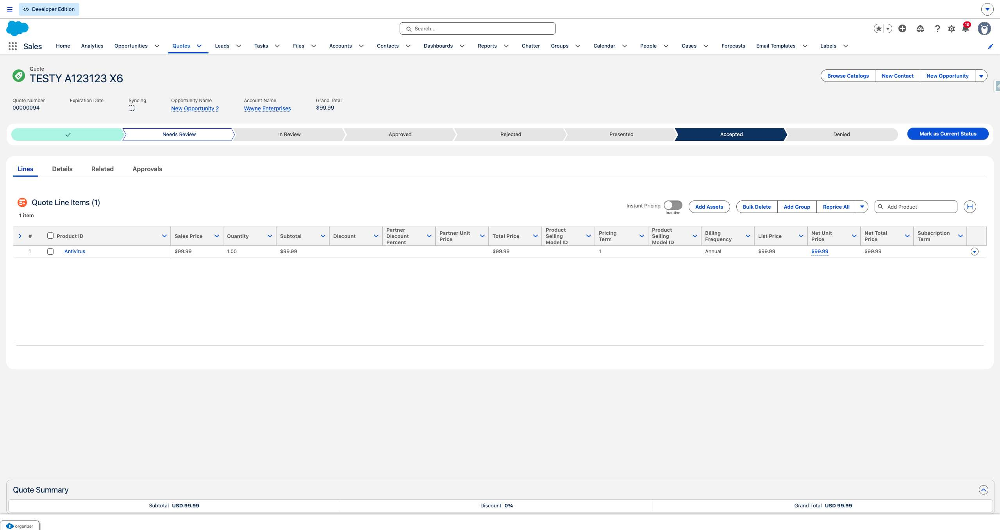
7. The user clicks on "Create Order".
   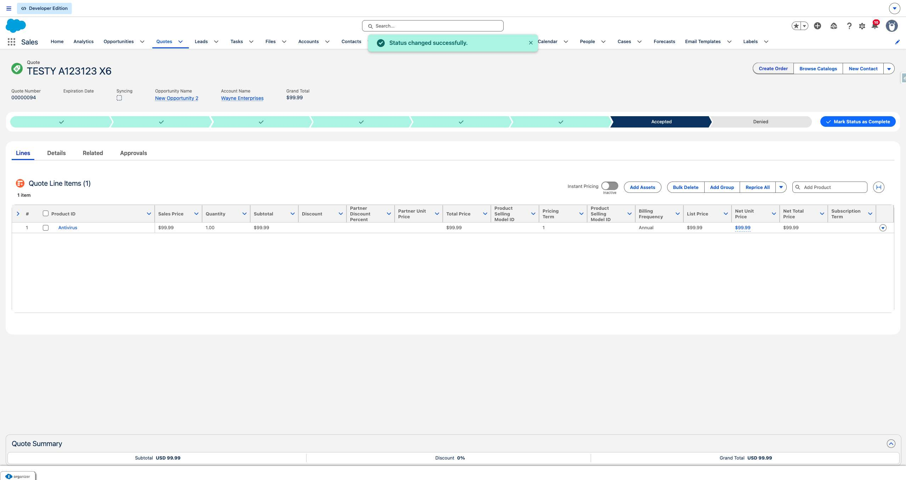
8. The user clicks on "Cancel and close
Create Order
Select an option to use for generating orders.
Cre".
   
9. The user clicks on "Create Single Order
Create a single order from the quote.".
   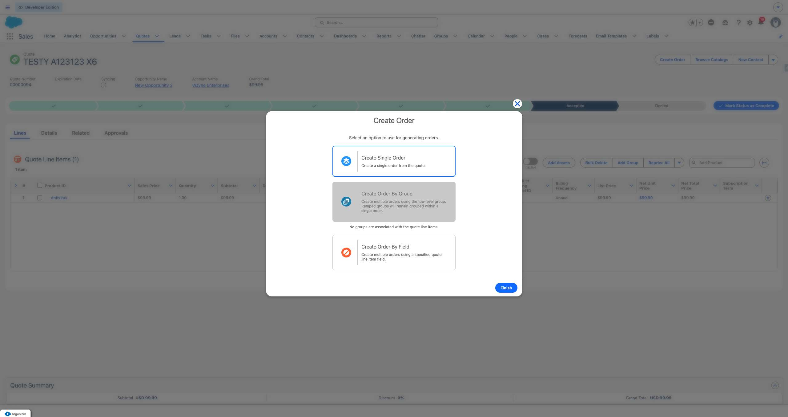
10. The user fills in "Create Single Order
Create a single order from the quote." with "CreateSingleOrder".
11. The user clicks on "Finish".
   
12. The user clicks on "00000175".
   
13. The user navigates to https://firstchair-b-dev-ed.develop.lightning.force.com/lightning/r/Order/801ak00003Sohh6AAB/view.
14. The user clicks on "00000175".
   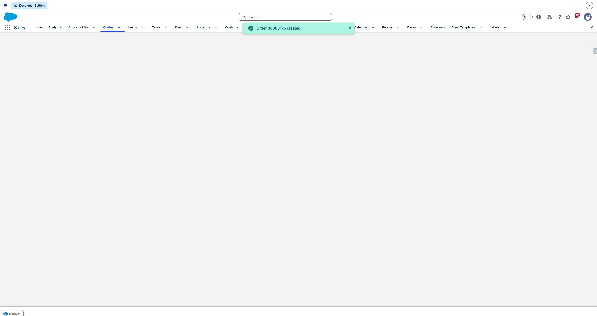
15. The user clicks on "Details".
   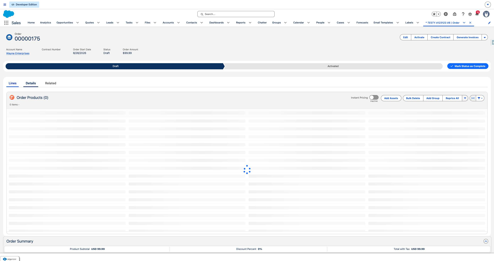
16. The user clicks on "Edit Bill To Contact".
   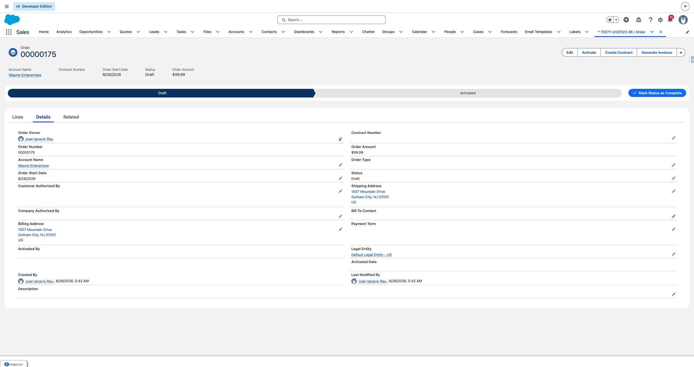
17. The user clicks on "Bill To Contact".
   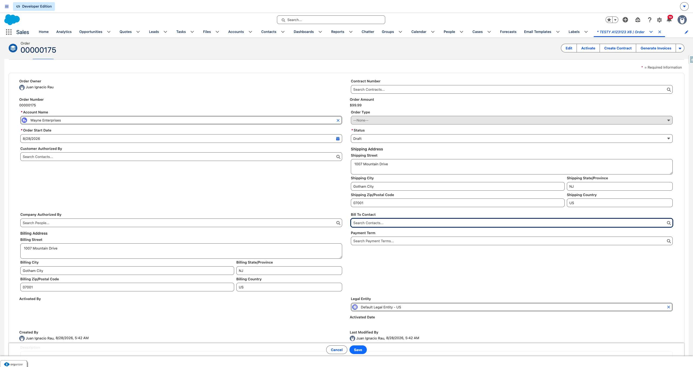
18. The user clicks on "* = Required Information
Order Owner
Juan Ignacio Rau
Contract Number
Order Numb".
   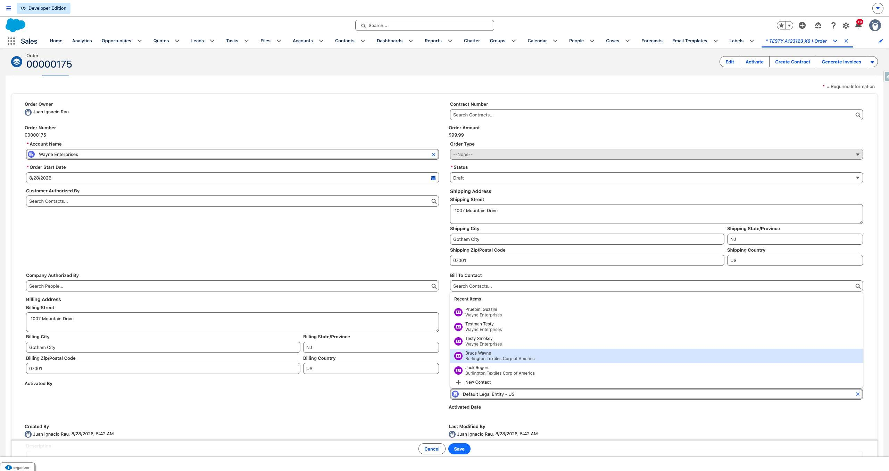
19. The user clicks on "Save".
   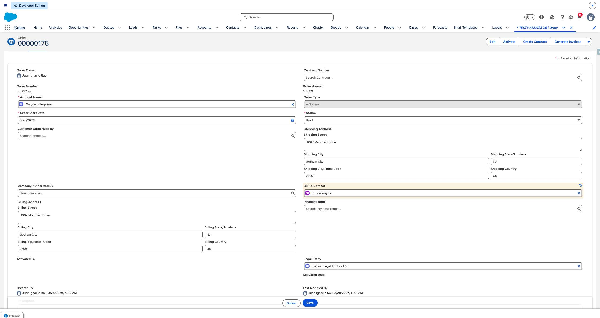
